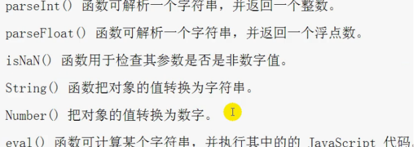
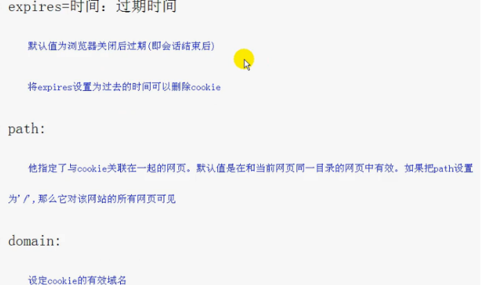

### 介绍HTTP和HTTPS

**基本概念：**

HTTP：超文本传输协议，是互联网上最广泛的一种网络协议，是客户端和服务端请求和应答的标准(TCP)，主要用于从WWW服务器传输超文本到本地浏览器的传输协议，是浏览器更高效，

HTTPS：是以安全为目标的HTTP通道，也就是HTTP的安全版，在HTTP下加入了SSL层，HTTPS的安全基础是SSL，因此加密的详细内容就需要SSL，

作用建立一个信息安全通道，确保数组的传输，确保网站的真实性

**区别：**

是否加密：http 是超文本传输协议，信息是明文传输，https 则是具有安全性的ssl 加密传输协议。

链接方式：使用不同的链接方式，端口也不同，一般而言，http 协议的端口为80，https 的端口为443

安全性： http 的连接很简单，是无状态的；HTTPS 协议是由 SSL+HTTP 协议构建的可进行加密传输、身份认证的网络协议，比 http 协议安全。

**HTTPS的工作原理**

客户端在使用 HTTPS 方式与 Web 服务器通信时有以下几个步骤，

客户使用 https url 访问服务器，则要求 web 服务器建立 ssl 链接。

web 服务器接收到客户端的请求之后，会将网站的证书（证书中包含了公钥），返回或者说传输给客户端。

 客户端和 web 服务器端开始协商 SSL 链接的安全等级，也就是加密等级。

客户端浏览器通过双方协商一致的安全等级，建立会话密钥，然后通过网站的公钥来加密会话密钥，并传送给网站。 

web 服务器通过自己的私钥解密出会话密钥。 web 服务器通过会话密钥加密与客户端之间的通信

**https 协议的优点**

使用 HTTPS 协议可认证用户和服务器，确保数据发送到正确的客户机和服务器；

HTTPS 协议是由 SSL+HTTP 协议构建的可进行加密传输、身份认证的网络协议，要比http 协议安全，可防止数据在传输过程中不被窃取、改变，确保数据的完整性。

HTTPS 是现行架构下最安全的解决方案，虽然不是绝对安全，但它大幅增加了中间人攻击的成本。

**https 协议的缺点**

https 握手阶段比较费时，会使页面加载时间延长 50%，增加 10%~20%的耗电。

https 缓存不如 http 高效，会增加数据开销。

 SSL 证书也需要钱，功能越强大的证书费用越高。

 SSL 证书需要绑定 IP，不能再同一个 ip 上绑定多个域名，ipv4 资源支持不了这种消耗。

### tcp 三次握手

### TCP 和 UDP 的区别

（1）TCP 是面向连接的，udp 是无连接的即发送数据前不需要先建立链接。

（2）TCP 提供可靠的服务。也就是说，通过 TCP 连接传送的数据，无差错，不丢失，不重复，且按序到达;UDP 尽最大努力交付，即不保证可靠交付。并且因为tcp 可靠，面向连接，不会丢失数据因此适合大数据量的交换。 

（3）TCP 是面向字节流，UDP 面向报文，并且网络出现拥塞不会使得发送速率降低（因此会出现丢包，对实时的应用比如 IP 电话和视频会议等）。

（4）TCP 只能是 1 对 1 的，UDP 支持 1 对 1,1 对多。 

（5）TCP 的首部较大为 20 字节，而 UDP 只有 8 字节。

（6）TCP 是面向连接的可靠性传输，而 UDP 是不可靠的。

### WebSocket

### 对象深度克隆的简单实现

```js
function deepClone(obj) {
    var newObj = obj instanceof Array ? [] : {};
    for (var item in obj) {
        var temple = typeof obj[item] ==='object' ? deepClone(obj[item]) : obj[item]
        newObj[item] = temple
    }
    return newObj;
}
```

### 将原生的ajax封装成promise

```js
var myNewAjax = function (url) {
    return new Promise((resolve,reject) => {
        var xhr = new XMLHttpRequest();
        xhr.open('get',url);
        xhr.send(data);
        xhr.onreadystatechange = function() {
            if(xhr.status==200&&readyState==4) {
               var json = JSON.parse(xhr.responseText)
               resolve(json)
            } else if (xhr.readyState==4&&xhr.status!=200) {
                reject('error')
            }
        }
    })
}
```

### JS继承实现的几种方式

**原型链继承**

将父类的实例作为子类的原型，特点是父类新增的方法属性，子类都能够访问，并且原型链继承简单易于实现，缺点是来自原型对象的所有属性被所有实例共享，无法实现多继承，无法向父类构造函数传参。

```js
class Animal {
    
}
class Cat {}

let animal = new Animal()
Cat.prototype = animal
```

**构造继承**

使用父类的构造函数来增强子类实例，即复制父类的实例属性给子类，构造继承可以向父类传递参数，可以实现多继承，通过 call 多个父类对象。但是构造继承只能继承父类的实例属性和方法，不能继承原型属性和方法，无法实现函数复用，每个子类都有父类实例函数的副本，影响性能

**实例继承**

为父类实例添加新特性，作为子类实例返回，实例继承的特点是不限制调用方法，不管是 new 子类（）还是子类（）返回的对象具有相同的效果，缺点是实例是父类的实例，不是子类的实例，不支持多继承

**拷贝继承**

特点：支持多继承，缺点：效率较低，内存占用高（因为要拷贝父类的属性）无法获取父类不可枚举的方法（不可枚举方法，不能使用for in 访问到）

**组合继承**

通过调用父类构造，继承父类的属性并保留传参的优点，然后通过将父类实例作为子类原型，实现函数复用

**寄生组合继承**

通过寄生方式，砍掉父类的实例属性，这样，在调用两次父类的构造的时候，就不会初始化两次实例方法/属性，避免的组合继承的缺点

### 写一个函数，第一秒打印1，第二秒打印2

**块级作用域**

```js
for (let i = 0; i<5; i++) {
    setTimeout(function() {
        console.log(i)
    },1000 * i)
}
```

**使用闭包**

```js
for (let i = 0; i<5; i++) {
    (function(i) {
        setTimeout(function() {
        	console.log(i)
    	},1000 * i)
    })(i)
    
}
```

JPG，PNG，gif，jpeg，**svg，svga**

CSS盒模型：

padding,border,margin,cotent

盒子宽：padding-left * 2+ margin-left * 2+ content的宽

盒子高：padding-top * 2 + marign-top * 2 +content的高

视频，音频

```javascript
视频
<vedio  src ="" / >
    关于视频属性:
    src:视频路径
    width,height:播放器的宽高，和图片的宽高一样
    autoplay:是否自动播放，打开时自动播放
    controls:是否显示控制条
    poster:在未播放时展示的图片，这里写图片的路径
    loop:是否可以循环播放
    perload:是否可以预加载，这个属性与autoplay冲突，因为设置了autoplay属性，perload会失效
    muted:静音模式
音频
<audio src = "" />
    音频的属性除了poster属性，宽高之外，其他的和视频的类似

```

**HTML5新增语义：复习HTML**

介绍一下HTML5：定义HTML标准的新版本，相比较HTML而言，他扩展了很多新的元素，元素属性，以及很多行为，他具有的优势，①跨平台②快速迭代③降低成本④分发效率高

**什么是DOCTYPE**: **Document Type Declaration **  根据单词翻译过来就是文档类型声明

```html
位置：放在整个HTML文档的最上边，目的告诉浏览器该文档的类型，根据类型决定渲染模式，根据渲染模式在渲染后面HTML代码
```

```html
不同渲染模式会影响到浏览器对于CSS代码甚至JavaScript脚本的解析
```

```html
怪异模式：标准兼容未开启，ie5之前的浏览器有自己的渲染模式，不跟随标准的模式走
标准模式：标准兼容已开启，ie6之后才开始慢慢的趋向标准模式，

现代的浏览器对于这两个模式基本没多大的差别了
既然HTML提供<DOCTYPE html>，是标准模式，那么浏览器在渲染的时候就按照W3C的标准进行渲染页面，
而不包含<DOCTYPE html>的网页被称为怪异模式
    
```

**HTML的根元素：**`<html></html>`

**关于head元素：**MIME类型，包括但不限于  { 文本的：text/html，图片：jpg:image/jpeg  ，png:image/png }

<meta charset="UTF-8">:	告诉浏览器你应该使用哪种编码来解析网页
**语义化标签：**html5出来之前：使用div表示了任何东西，html5之后，出来了一下标签：


```html
<hgroup></hgroup> 
<header></header>
<nav></nav>
<section></section>
<footer></footer>
<article></article>
<aside></aside>
对这些的详细信息查看：G:\前端\面试资料\html5\笔记\html5
```

好处：①代替了大量无意义的div元素，②提升了网页的质量和语义，③对搜索引擎更加友好

区别：与div相比，他们会另起一行


**CSS3的新增属性：复习CSS3 **


#### 使用的浏览器，和浏览器的内核是什么？

| 浏览器  | 内核                |
| ------- | ------------------- |
| chrome  | Bink 基于（webkit） |
| firefox | gecko               |
| Safari  | webkit              |

#### HTML文件开头的Doctype是什么？

Doctype是声明一个该文档的类型，一般有HTML、XHTML，表明是什么类型，好让浏览器去使用何种规范做解析；

严格模式和混杂模式

严格模式下：页面的排版及JS解析是以浏览器支持的最高标准来执行

混杂模式：不严格安装标准执行，主要用来兼容旧的浏览器，向后兼容

#### div + css的布局较table的布局有什么优点

1. div+css比table较灵活，可以随意的设置不同的布局
2. 页面加载快，结构化清晰，页面显示很简洁
3. 易于优化seo搜索引擎，排名更靠前

#### img的alt与title有何不同？strong与em的异同？

img的alt在浏览器无法载入图像时，替换文本属性告诉读者她们失去的信息。此时，浏览器将显示这个替代性的文本而不是图像。为页面上的图像都加上替换文本属性是个好习惯，

title（tool tip）是鼠标放到图片上的提示的建议性文字

strong和em是对文字进行加粗和倾斜，strong表是内容的重要性，em表强调

#### 为什么利用多个域名来存储网站资源会更有效？

1. CDN缓存更方便
2. 突破浏览器并发限制
3. 节约cookie宽带
4. 节约主域名的连接数，优化页面响应速度
5. 防止不必要的安全问题

#### cookies，sessionStorage和localStorage的区别？

sessionStorage：会话存储，只有在同一个页面中才能访问到，当这个页面会话结束后数据也随之销毁，不是持久化的本地存储

localStorage：本地存储，是持久化的存储，除非主动删除数据，否则数据永远不会过期

cookies：大小受限，每次请求新页面cookie都会被发生过去，浪费宽带；不可跨域调用

Cookie 的作用是与服务器进行交互，作为 HTTP 规范的一部分而存在 ，而 Web Storage 仅仅是为 了在本地“存储”数据而生

#### 简述src和href的区别

href：用于在当前文档引用其他资源

src：

1. 指向外部资源的位置，指向的内容将会嵌入到文档中当前标签所在的位置
2. 在src请求资源时会将其指向的资源下载并应用到文档内

src用的例如：js脚本，img图片和frame元素等

在浏览器解析script脚本引入的资源时，会暂停其他资源的下载和处理，制度将script脚本引入的资源加载，编译、执行完才会处理其他资源，图片和框架等元素也是这样。一般将js脚本放到底部

link通过href引入资源，会并行下载资源并且不会停止对当前文档的 处理，建议用link方式来加载css，而不是@import的方式

#### 网页制作用到的图片格式？

png、jpg、gif，webp、

webp是谷歌开发的加快图片格式加载速度的图片格式。图片压缩体积只有JPEG的2/3，并能节省大量的服务器资源和数据空间

在质量相同的情况下，webp格式图像的提交要比JPEG小40%

#### 在css/js代码上线之后，从用户刷新网页开始，一次js请求一般会在哪些地方有缓存处理？

浏览器缓存，dns缓存，cdn缓存，服务器缓存

#### 对页面上的大量图片，加载很慢，有哪些优化方法

1. 用 CSSsprite，SVGsprite，Iconfont、Base64 等技术来替换png这种图片
2. 在指定区域进行加载，优先加载在可视区中的图片，可以通过添加滚动条事件，判断图片位置与浏览器顶端的距离与页面的距离，前者小于后者，优先加载
3. 图片如果过大，可以使用特殊编码的图片，加载时会先加载一张压缩特别厉害的压缩图

#### 对DOM设置css样式的方式

外部样式表：引入外部文件

内部样式表：将css代码放在<head>标签内部

内联样式： 在标签内部直接书写css样式

#### CSS都有哪些选择器？

| 名称         | 实例                                                    |
| ------------ | ------------------------------------------------------- |
| id选择器     | #box {}                                                 |
| 类选择器     | .box {}                                                 |
| 通配符选择器 | * {}    对所有的元素设置css样式                         |
| 标签选择器   | div {}  对所有div标签设置css样式                        |
| 后代选择器   | div span {}  div 下的 span 元素     无限制隔代          |
| 复合选择器   | div.box {} 是div并且包含类名为box的元素                 |
| 子代选择器   | div > span {}   选中div下面的span元素，p下的span不算    |
| 并集选择器   | .box,.box1,.box2 {}  box、box1、box2都被设置为相同的css |


**css3中新增的选择器**

属性选择器

| 选择器        | 示例 | 含义                                |
| ------------- | ---- | ----------------------------------- |
| E[attr]       |      | 存在attr属性即可                    |
| E[attr=val]   |      | 属性值完全等于val                   |
| E[attr\*=val] |      | 属性值里包含val字符并且在“任意”位置 |
| E[attr^=val]  |      | 属性值里包含val字符并且在“开始”位置 |
| E[attr$=val]  |      | 属性值里包含val字符并且在“结束”位置 |

伪类选择器

:link、:active、:visited、:hover

| 选择器              | 示例 | 含义                                         |
| ------------------- | ---- | -------------------------------------------- |
| E:first-child       |      | 其父元素的第1个子元素                        |
| E:last-child        |      | 其父元素的最后1个子元素                      |
| E:nth-child(n)      |      | 其父元素的第n个子元素                        |
| E:nth-last-child(n) |      | 其父元素的第n个子元素（倒着数），最后一个是1 |

伪元素选择器

E::first-letter文本的第一个单词或字；

E::first-line 文本第一行；

E::selection 可改变选中文本的样式；

E::before和E::after  给元素之前和之后设置内容

CSS3 新增伪类举例： 

p:first-of-type 选择属于其父元素的首个 <p> 元素的每个 <p> 元素。 

p:last-of-type 选择属于其父元素的最后 <p> 元素的每个 <p> 元素。 

p:only-of-type 选择属于其父元素唯一的 <p> 元素的每个 <p> 元素。 

p:only-child 选择属于其父元素的唯一子元素的每个 <p> 元素。 

p:nth-child(2) 选择属于其父元素的第二个子元素的每个 <p> 元素。 

:enabled、:disabled 控制表单控件的禁用状态。 

:checked，单选框或复选框被选中。 

#### css选择器的优先级

一般的计算方法：

1		表示 派生选择器的优先级

10  	表示类选择器的优先级

100	表示id选择器的优先级

1000  表示!important

在一个类里面，后写的类名样式优先级高于之前类名的优先级

```css
.box1 {
	color: red
}
.box2 {
	color: green;
}
```

```html
<div class="box1 box2"></div>
```

div最后以box2的类名为准

#### css可见性的设置都有哪些

| **单词**           | **作用**         |
| ------------------ | ---------------- |
| overflow：hidden   | 隐藏超出的那部分 |
| display：none      | 不显示元素       |
| visibility:hidden; | 不显示元素       |

特点总结：
     1：display:none        元素隐藏不占位置，可以理解把元素删除掉
     2：overflow:hidden;  将超出部分的元素隐藏，
     3：visibility:hidden;    元素隐藏占位置，不会改变页面布局，也不会触发该元素绑定的事件

也可以设置宽高为0，透明度为0，z-index位置在-1000，但会触发绑定的事件

#### 超链接访问过后hover样式就不出现的问题

被点击访问过的超链接样式不在具有 hover 和 active 了,解决方法是改变 CSS 属性的 排列顺序: L-V-H-A

（link,visited,hover,active）

#### CSS写一个幻灯片的效果

```html
<div class="ani"></div>
```

```css
.ani {
    width: 480px;
    height: 320px;
    margin: 50px auto;
    overflow: hidden;
    box-shadow: 0 0 5px rgba(0, 0, 0, 1);
    background-size: cover;
    background-position: center;
    -webkit-animation-name: "loops";// 定义一个动画名称
    -webkit-animation-duration: 20s; // 一个周期为20s
    -webkit-animation-iteration-count: infinite;  // 无限循环
}
@-webkit-keyframes "loops"
{
    0% {
        background: url(http://d.hiphotos.baidu.com/image/w%3D400/sign=c01e6adca964034f0fcdc3069fc27980/e824b899a9014c08e5e38ca4087b02087af4f4d3.jpg) no-repeat;
    }

    25% {
        background: url(http://b.hiphotos.baidu.com/image/w%3D400/sign=edee1572e9f81a4c2632edc9e72b6029/30adcbef76094b364d72bceba1cc7cd98c109dd0.jpg) no-repeat;
    }

    50% {
        background: url(http://b.hiphotos.baidu.com/image/w%3D400/sign=937dace2552c11dfded1be2353266255/d8f9d72a6059252d258e7605369b033b5bb5b912.jpg) no-repeat;
    }

    75% {
        background: url(http://g.hiphotos.baidu.com/image/w%3D400/sign=7d37500b8544ebf86d71653fe9f9d736/0df431adcbef76095d61f0972cdda3cc7cd99e4b.jpg) no-repeat;
    }

    100% {
        background: url(http://c.hiphotos.baidu.com/image/w%3D400/sign=cfb239ceb0fb43161a1f7b7a10a54642/3b87e950352ac65ce2e73f76f9f2b21192138ad1.jpg) no-repeat;
    }
}
```

20一个周期，在这个周期内循环展示不同的背景图片

#### 行内元素和块元素

行内元素：

span  strong  a  em   del  

块元素：

div   p   ul   li 	h1-h6

空元素：

br	hr	link	meat	area	base等

行内元素设置宽高		上下margin	padding 无效，左右有效	

块元素单独在一行显示，后面的元素也另起一行显示，宽高   内外边距 有效，自动填满父元素


浏览器默认的inline-block元素  ，他们可设置宽高，但不会自动换行：
input	img	button	texterea	label

#### 外边距重叠？外边距重叠的结果是什么

两个上下相邻的块元素，设置外边距，他们之间的外边距可以结合成一个单独的外边距

计算规则：

两个相邻的外边距都是正数，折叠结果是他们两者之间较大的值；

两个相邻外边距都是负数，折叠结果是两者绝对值的较大值

两个外边距一正一负时，折叠结果是两者的相加的和

#### rgba和opacity的透明度有什么不同

rgba的设置方法

```css
background: rgba(123,123,123,0.1)
```

opacity的设置方法：

```css
opacity: 0.1
```

rgba是在对背景色的透明度进行设置，设置透明元素的子元素不会继承透明效果

opacity在有无背景色的情况下，对元素内所有内容设置透明度。

#### 如何垂直居中一个浮动的元素

一个浮动的元素是脱离文档流的，可以使用transform

未知元素的宽高

```css
div {
	width: 100px;
    height: 100px;
    transform: translate(50%,50%);
    left: -50%;
    top: -50%;
    background: pink;
}
```

已知元素的宽高

```css
div {
	background: yellow;
    width: 200px;
    height: 200px;
    position: absoulte;
    left: 50%;
    top: 50%;
    margin-left: -100px;
    margin-top: -100px;
}
```

如何垂直居中一个img

对img的容器设置如下：

```css
#container {
	display: table-cell;
    text-align: center;
    vertical-align: middle;
}
```

#### 垂直居中的方法

1. margin: auto方法，定位为上下左右为 0，margin：0 可以实现脱离文档流的居中

```css
div{ width: 400px; 
    height: 400px;
    position: relative;
    border: 1px solid #465468; 
}
img{ 
    position: absolute;
    margin: auto; 
    top: 0; 
    left: 0; 
    right: 0; 
    bottom: 0; 
}
```

```html
<div>
	
</div>
```

2. margin 负值法

```css
.container{ 
    width: 500px; 
    height: 400px; 
    border: 2px solid #379; 
    position: relative; 
}
.inner{
    width: 480px; 
    height: 380px; 
    background-color: #746; 
    position: absolute; 
    top: 50%; 
    left: 50%; 
    margin-top: -190px; /*height 的一半*/ 
    margin-left: -240px; /*width 的一半*/ 
}
```

补充：其实这里也可以将 marin-top 和 margin-left 负值替换成， 

transform：translateX(-50%)和 transform：translateY(-50%) 

3. table-cell（未脱离文档流的）

设置父元素的 display:table-cell,并且 vertical-align:middle，这样子元素可以实现垂直居中。

```css
div{ 
    width: 300px; 
    height: 300px; 
    border: 3px solid #555; 
    display: table-cell; 
    vertical-align: middle; 
    text-align: center; 
}
img{ 
    vertical-align: middle; 
}
```

4. 利用flex

将父元素设置为 display:flex，并且设置 align-items:center;justify-content:center;

#### px和em的区别

px: 是对元素或字体大小的绝对值，没有参考，无论什么情况下都是固定大小

em：他的值不固定，em会继承父级元素的字体大小

浏览器默认字体高都是16px，所有在没调整的情况下： 1em = 16px  12px = 0.75em

#### Sass、Less是什么？

他们是预处理器，对于开发者而言，他们提供的功能能够提高开发效率，比如提供的变量，函数，继承，运算等。而Less也可以支持在服务端上运行。

使写的样式文件，结构清晰，便于扩展，实现多重继承，完全兼容css代码，可以应用到老项目中去

#### css中的link标签和@import的区别

两者都是导入外部css的方式，Link是输入html标签，@import是CSS中提供的

使用link导入css的同时，可以解析其他资源，不会出现加载css资源的同时停止加载其他资源的情况

@import 加载导入的资源时，会在页面加载完成之后才会加载引用的CSS

Link样式的权重大于@import 的引用

#### 简述盒子模型

IE和模型和标准W3C盒模型

IE盒模型： content，padding，border

W3C盒子模型的组成部分： 内容，内边距，边框，外边距

盒子内边距能够撑开盒子，能够增大盒子的宽高，如果设置了盒子的宽高，减去相应的内边距的值，维持盒子原有的大小。

padding的数值个数不同代表的意思

外边距值的是盒子与盒子之间的距离

在CSS3中引入box-sizing属性，

box-sizing:content-box;表示标准的盒子模型；

box-sizing: border-box表示ie盒子模型；

而box-sizing: padding-box,这个属性值的宽度包含了左右padding+width

**块级盒子水平居中：**
盒子必须指定宽度；

给盒子左右外边距都设置auto

```css
.header {
	width: 900px;
    margin: 0 auto;
}
```

**文字居中和盒子居中的区别：**

```
text-align: center;
```

**插入图片和背景图片的区别：**

1. 插入图片 我们用的最多 比如产品展示类  移动位置只能靠盒模型 padding margin
2. 背景图片我们一般用于小图标背景 或者 超大背景图片  背景图片 只能通过  background-position

```css
 img {  
		width: 200px;/* 插入图片更改大小 width 和 height */
		height: 210px;
		margin-top: 30px;  /* 插入图片更改位置 可以用margin 或padding  盒模型 */
		margin-left: 50px; /* 插入当图片也是一个盒子 */
	}

 div {
		width: 400px;
		height: 400px;
		border: 1px solid purple;
		background: #fff url(images/sun.jpg) no-repeat;
		background-position: 30px 50px; /* 背景图片更改位置 我用 background-position */
	}
```

**清除元素默认内外边距：**

一般将元素的默认内外边距清除

```css
* {
	padding: 0;
	margin: 0;
}
```

**盒子模型内外边距的适用场景：**

大部分情况下可以混用

有边框，盒子之间的距离时可以分别用padding，和margin来设置

**WEB标准和W3C的理解**

标签闭合、标签小写、不乱嵌套、提高搜索机器人搜索几率、使用外 链 css 和 js 脚本、 

结构行为表现的分离、文件下载与页面速度更快、内容能被更多的用户所访问、内容能被更 广泛的设备所访问、更少的代码和组件，容易维 护、改版方便，不需要变动页面内容、提 供打印版本而不需要复制内容、提高网站易用性

#### 简述盒子阴影

语法：

```
box-shadow: 水平阴影 垂直阴影 模糊距离（虚实）  阴影尺寸（影子大小）  阴影颜色  内/外阴影；
```

| 值       | 描述                           |
| -------- | ------------------------------ |
| h-shadow | 必须。水平阴影的位置，可以负值 |
| v-shadow | 必须。垂直阴影的位置，可以负值 |
| blue     | 可选，模糊距离                 |
| spread   | 可选。阴影尺寸                 |
| color    | 可选。阴影颜色                 |
| inset    | 可选。是否将外阴影改为内阴影   |

```css
div {
    width: 200px;
    height: 200px;
    border: 10px solid red;
    /* box-shadow: 5px 5px 3px 4px rgba(0, 0, 0, .4);  */
    /* box-shadow:水平位置 垂直位置 模糊距离 阴影尺寸（影子大小） 阴影颜色  内/外阴影； */
    box-shadow: 0 15px 30px  rgba(0, 0, 0, .4);
}
```

#### 初始化样式

由于浏览器兼容的问题，不同的浏览器对标签的默认样式值不同，若不初始化会造成不同浏览器之间的显示差异 

但是初始化 CSS 会对搜索引擎优化造成小影响

#### HTML常见的兼容性

2 像素问题 使用 float 引起的 使用 dislpay:inline -3px 

3.超链接 hover 点击后失效 使用正确的书写顺序 link visited hover active 

4.Ie z-index 问题 给父级添加 position:relative 

5.png 透明 使用 js 代码 改 

#### HTML语义化

当页面样式加载失败的时候能够让页面呈现出清晰的结构 

有利于 seo 优化，利于被搜索引擎收录（更便于搜索引擎的爬虫程序来识别） 

便于项目的开发及维护，使 html 代码更具有可读性，便于其他设备解析

#### BFC是什么

bfc是块级格式化上下文；

一个创建了新的BFC的盒子是独立布局的，盒子内元素的布局不会影响盒子外面的元素

在同一个 BFC 中的两个相邻的盒子在垂直方向发生 margin 重叠 的问题 

BFC 是指浏览器中创建了一个独立的渲染区域，该区域内所有元素的布局不会影响到区域外 元素的布局，这个渲染区域只对块级元素起作用 

下列元素会生成BFC:

根元素

float部位none的元素

position为fixed和absolute的元素

display 为 inline-block、table-cell、table-caption，flex，inline-flex 的元素

overflow 不为 visible 的元素

解决以下问题：

1. 防止垂直margin重叠
   Box垂直方向的距离由margin决定。属于同一个BFC的两个相邻Box的margin会发生重叠

2. 清除内部浮动
   计算BFC的高度时，浮动元素也参与计算
3. 自适应两栏布局
   每个元素的margin box的左边， 与包含块border box的左边相接触(对于从左往右的格式化，否则相反)。即使存在浮动也是如此。

#### Display的值

| 值           | 描述                                           |
| ------------ | ---------------------------------------------- |
| block        | 像块类型元素一样                               |
| inline-block | 像行内元素一样显示，但内容像块类型元素一样显示 |
| none         | 缺省值，向行内元素一样显示                     |
| list-item    | 像块类型元素一样显示，并添加样式列表标记       |
|              |                                                |
|              |                                                |

#### Position的值

| 值       | 描述                         |
| -------- | ---------------------------- |
| fixed    | 以浏览器为基准，固定盒子     |
| relative | 以自身为基准                 |
| inherit  | 继承父元素的position的值     |
| absolute | 以最近父元素为relative为基准 |
| static   | 默认安装文档流来排列         |
|          |                              |

固定定位 fixed： 

元素的位置相对于浏览器窗口是固定位置，即使窗口是滚动的它也不会移动。Fixed 定 位使元素的位置与文档流无关，因此不占据空间。 Fixed 定位的元素和其他元素重叠。 

相对定位 relative： 

如果对一个元素进行相对定位，它将出现在它所在的位置上。然后，可以通过设置垂直 或水平位置，让这个元素“相对于”它的起点进行移动。 在使用相对定位时，无论是 否进行移动，元素仍然占据原来的空间。因此，移动元素会导致它覆盖其它框。 

绝对定位 absolute： 

绝对定位的元素的位置相对于最近的已定位父元素，如果元素没有已定位的父元素，那 么它的位置相对于<html>。absolute 定位使元素的位置与文档流无关，因此不占据空间。 absolute 定位的元素和其他元素重叠。 

粘性定位 sticky：元素先按照普通文档流定位，然后相对于该元素在流中的 flow root（BFC）和 containing 

block（最近的块级祖先元素）定位。而后，元素定位表现为在跨越特定阈值前为相对定 位，之后为固定定位。 

默认定位 Static： 

默认值。没有定位，元素出现在正常的流中（忽略 top, bottom, left, right 或者 z-index 声 明）。 

inherit: 规定应该从父元素继承 position 属性的值。

#### 如何画0.5px的线

采用meta viewport的方式

```html
<meta name="viewport" content="init-scale=1.0,maximum-scale=1.0,user-scalabl=no" />
```

采用border-image的方式

采用transform: scale()的方式

#### Transition和Animation的区别

**Animation的案例：**

css

```css
#myDIV {
    width:300px;
    height:200px;
    background:red;
    animation: mymove 5s infinite;
}
@keyframes mymove {
    from {background-color:red;}
    to {background-color:blue;}
}
 keyframes也可以使用百分比：
@keyframes mymove
{
    0%   {background: red; left:0px; top:0px;}
    25%  {background: yellow; left:200px; top:0px;}
    50%  {background: blue; left:200px; top:200px;}
    75%  {background: green; left:0px; top:200px;}
    100% {background: red; left:0px; top:0px;}
}
```

html

```html
<div id="myDIV"></div>
```

| 属性                                                         | 描述                                                         | CSS  |
| :----------------------------------------------------------- | :----------------------------------------------------------- | :--- |
| [@keyframes](https://www.runoob.com/cssref/css3-pr-animation-keyframes.html) | 规定动画。                                                   | 3    |
| [animation](https://www.runoob.com/cssref/css3-pr-animation.html) | 所有动画属性的简写属性。                                     | 3    |
| [animation-name](https://www.runoob.com/cssref/css3-pr-animation-name.html) | 规定 @keyframes 动画的名称。                                 | 3    |
| [animation-duration](https://www.runoob.com/cssref/css3-pr-animation-duration.html) | 规定动画完成一个周期所花费的秒或毫秒。默认是 0。             | 3    |
| [animation-timing-function](https://www.runoob.com/cssref/css3-pr-animation-timing-function.html) | 规定动画的速度曲线。默认是 "ease"。                          | 3    |
| [animation-fill-mode](https://www.runoob.com/cssref/css3-pr-animation-fill-mode.html) | 规定当动画不播放时（当动画完成时，或当动画有一个延迟未开始播放时），要应用到元素的样式。 | 3    |
| [animation-delay](https://www.runoob.com/cssref/css3-pr-animation-delay.html) | 规定动画何时开始。默认是 0。                                 | 3    |
| [animation-iteration-count](https://www.runoob.com/cssref/css3-pr-animation-iteration-count.html) | 规定动画被播放的次数。默认是 1。                             | 3    |
| [animation-direction](https://www.runoob.com/cssref/css3-pr-animation-direction.html) | 规定动画是否在下一周期逆向地播放。默认是 "normal"。          | 3    |
| [animation-play-state](https://www.runoob.com/cssref/css3-pr-animation-play-state.html) | 规定动画是否正在运行或暂停。默认是 "running"。               | 3    |

**Transition的例子**

```css
div {
    width: 100px;
    height: 100px;
    background: red;
    transition: width 2s, height 2s, transform 2s;
}

div:hover {
    width: 200px;
    height: 200px;
    transform: rotate(180deg);
}
```

```html
<div>鼠标移动到 div 元素上，查看过渡效果。</div>
```

要实现这一点，必须规定两项内容：

- 指定要添加效果的CSS属性
- 指定效果的持续时间。

要添加多个样式的变换效果，添加的属性由逗号分隔：

```css
div
{
    transition: width 2s, height 2s, transform 2s;
}
```

| 属性                                                         | 描述                                         | CSS  |
| :----------------------------------------------------------- | :------------------------------------------- | :--- |
| [transition](https://www.runoob.com/cssref/css3-pr-transition.html) | 简写属性，用于在一个属性中设置四个过渡属性。 | 3    |
| [transition-property](https://www.runoob.com/cssref/css3-pr-transition-property.html) | 规定应用过渡的 CSS 属性的名称。              | 3    |
| [transition-duration](https://www.runoob.com/cssref/css3-pr-transition-duration.html) | 定义过渡效果花费的时间。默认是 0。           | 3    |
| [transition-timing-function](https://www.runoob.com/cssref/css3-pr-transition-timing-function.html) | 规定过渡效果的时间曲线。默认是 "ease"。      | 3    |
| [transition-delay](https://www.runoob.com/cssref/css3-pr-transition-delay.html) | 规定过渡效果何时开始。默认是 0。             | 3    |

Animation和Transition大部分属性是相同的，他们都是随时间改变元素的属性值，主要区别是：


1. Transition 强调过渡; Animation 强调流程与控制，在css3中称作动画 。


2. 两者的控制粒度不一样
   1. 某种程度上, Transition 更加粗一点, 比如过渡的速度进行了封装, 可以控制是匀速改变还是贝塞尔曲线之类的。
   2. Animation 提供的 keyframe 方法, 可以让你手动去指定每个阶段的属性; 此外 Animation 还封装了循环次数, 动画延迟等功能, 更加自由和强大。

3. 动画状态: 
   1. CSS的 Transition 只有两个状态:开始状态 和 结束状态 。
   2. animation 可能是多个状态, 有帧的概念 。

4. 动画触发方式:
   1. CSS的transition需要借助别的方式来触发, 比如CSS的状态选择器（如:hover）或 借助JavaScript来触发 。
   2. Animation 不但可以使用上面的方式触发, 更重要的是可以自动触发 。

5. Animation 控制动效上要比 Transition 强，因为它具备一些控制动效的属性，比如“播放次数”、“播放方向”、“播放状态”等。

6. 动画实现的范围:
   1. Transition 是有一定限制的, 并不是所有 CSS 的属性都具有过渡效果 。
   2. 另外相比而言, CSS 的 Animation 要比 Transition 强大的多, 几乎所有的 css 属性都可以实现动画效果。
   3. 这也是为什么使用 Animation 制作 Web 动画的场景更多 。

7. 动画实现方式
   1. CSS 的 Animation 是离不开 @keyframes 的，换句话说，我们需要先使用 @keyframes 来注册一个动画效果，即帧来描述动画效果。当然，只注册也不见得有效果，还是需要使用 animation-name 属性引用 @keyframes 注册好的动画效果。


"注意": CSS transform 也是用来制作动效的，这个说法有点偏颇，CSS transform 只不过提供了一些函数，可以做不同的变换，这些函数运用于 CSS 的 transition 或 @keyframes 中能得到一些不同的效果，特别是配上时间，缓动函数之类的，效果会更佳。因此也被识认为是动效中不可或缺。其实在 animation 中，可以发挥你的想象，使用 CSS 中任意属性，实现一些有创意的动效。

#### Flex布局

#### 浮动清除的方法

浮动案例

```html
<div id="box"><div id="son"></div></div>
```

```css
#box {
    width: 100px;
    background: red;
}
#son {
    width: 50px;
    height: 50px;
    background: blue;
    float:left;
}
```

一、使用一个空元素

在浮动元素后使用一个空元素，并在css中赋予属性去清除浮动

```html
<div class="clear"></div>
```

```css
.clear {
	clear: both;
}
```

二、使用css的overflow属性

给浮动元素的父容器添加 overflow:hidden;或 overflow:auto;可以清除浮动，浮动元素又回到了容器层，把容器高度撑起，达到了清理浮动 的效果

```css
#box {
    overflow:auto;
    // 或者
    overflow:hidden;
}
```

三、使用 CSS 的:after 伪元素 

结合:after 伪元素（代表一个元素之后最近的元素） ，可以完美兼容当前主流的各大浏览器给浮动元素的容器添加一个 clearfix 的 class，然后给这个 class 添加一个:after 伪元素实 现元素末尾添加一个看不见的块元素（Block element）清理浮动

```css
#box:after {
    content:'';
    clear:both;
    display:block;
}
```

#### Css3的新特性

- border-radius
- box-shadow
- css3背景
- text-shadow
- word-wrap

Css2D、3D转换、过渡

CSS3多列：

- column-count：属性规定元素应该被分隔的列数。
- column-gap：属性规定列之间的间隔。
- column-rule ：属性设置列之间的宽度、样式和颜色规则。

CSS3用户界面：

- resize：属性规定是否可由用户调整元素尺寸。
- box-sizing：属性允许您以确切的方式定义适应某个区域的具体内容。
- outline-offset ：属性对轮廓进行偏移，并在超出边框边缘的位置绘制轮廓

#### 如何实现图片在某个容器中居中的？

父元素固定宽高，利用定位及设置子元素 margin 值为自身的一半。 

父元素固定宽高，子元素设置 position: absolute，margin：auto 平均分配 margin 

css3 属性 transform。子元素设置 position: absolute; left: 50%; top: 50%;transform: translate(-50%,-50%);即可。 

将父元素设置成 display: table, 子元素设置为单元格 display: table-cell。 

弹性布局 display: flex。设置 align-items: center; justify-content: center

#### CSS3 中对溢出的处理

text-overflow 属性，值为 clip 是修剪文本；ellipsis 为显示省略符号来表被修剪的文本； 

string 为使用给定的字符串来代表被修剪的文本。

溢出省略的方法：

必须指定宽度，块和行内块元素

```css
overflow: hidden;
text-overflow: ellipsis;
-webkit-box-orient: vertical;
white-space: nowrap;
```

#### float 的元素，display 是什么

display 为 block


所用浏览器测试，浏览器的内核
Crome    Blink(基于webkit,Goole与Opera 共同开发)
Opera	旧：presto 新：Blink
Firefox	gecko

#### Doctype作用

在整个文档的最前面，告诉浏览器按照何种规范解析器页面

#### div+css的布局较table布局有什么优点?

优点：改版的时候方便，只需要改变css文件，表现与结构分离
页面加载速度更快，结构清晰话，页面显示简介

#### img的alt与tile的区别？strong与em的异同？

alt:当图片加载不出来的时候显示alt的属性值
title:当鼠标悬停上去显示的文字，提供建议性的信息
strong:对文字进行加粗处理，表示内容的重要性
em：对文字进行斜体强调标签，表示内容的强调点

#### cookies,sessionStrong和localSreong的区别？

sessionStrong：会话级别的存储，当会话结束后，数据也随之销毁，不是一种持久化的本地存储，是一种更大容量存储设计。
localStrong用于持久化的本地存储，只有主动删除数据，否则数据永远不会过期
Coolie的大小是受限制的，每次请求新页面的时候Cookie都会被发送过去，增加带宽，还需要指定作用域，不可以跨域调用。

#### src与href的区别？

src:替换当前元素，指向外部资源的位置，指向的内容将会嵌入带文档中当前标签所在的位置，在请求src资源时会将资源下载并应用到文档内，如js脚本,img图片和frame等元素，当浏览器解析到该元素时，会暂停其他资源的下载和处理，直到该资源加载、编译、执行完毕

<script src =”js.js”></script>
href:指向网络资源所在的位置，建立和当前元素或当前文档之间的链接
<link href="common.css" rel="stylesheet"/>

#### 从用户刷新网页开始，一次js请求一般情况下有哪些地方会有缓存处理？

dns缓存、cdn缓存、浏览器缓存、服务器缓存。
网页上有大量的图片，有哪些方法优化这些图片的加载，给用户良好的体验？
图片懒加载，在页面上未可视区域添加滚动事件，判断图片位置与浏览器顶端的距离与页面的距离，如果前者小于后者，优先加载，
幻灯片或相册时，可以使用图片预加载技术，将当前的图片的前一张和后一张优先加载
如果为css图片，可以使用Iconfont、Base64等技术
图片过大，可以使用特殊编码的图片，加载时会先加载一张压缩特别厉害的缩略图，提高用户体验

#### 有哪些方式可以对一个DOM设置它的CSS样式？

外部样式表，引入一个外部css文件
内部样式表：将css代码放在<head>标签内部
内联样式，直接将样式的定义在html元素内部

#### CSS都有哪些选择器

派生选择器（HTML的标签声明）
id选择器（DOM的id声明）
类选择器（用一样式类声明）
属性选择器（DOM属性声明，）
后代（利用空格间隔）、群组（逗号间隔）
CSS选择器的优先级基本原则：
选择器越特殊，优先级越高，
复杂的计算：1表示派生选择器的优先级，10表示类选择器的优先级、100表示ID选择器的优先级
当优先级相同时，与样式的先后顺序有关，用一选择器后面的样式会覆盖前面的，<p class=’classB classA’>中的先后关系无关。

#### CSS隐藏DOM元素？

最基本:
设置：visibility:hiddlen或者display:none
技巧性：
设置宽高为0，设置透明度为0 设置z-index位置在-1000

#### 超链接访问过后hover样式就不出现的问题是什么？如何解决？

被点击访问过的超链接不在具有hover和active，解决方法是改变CSS属性的排列顺序：L-V-H-A(link,visited,hover,active)

#### 使用CSS写一个简单的幻灯片效果页面

要用CSS3，使用animation动画实现一个简单的幻灯片效果?
CSS样式：


```css
* {
    margin: 0;
    padding: 0;
    font-family: 微软雅黑;
    list-style: none;
}
#box{
    width:400px;
    height:200px;
    border: 1px solid #000;
    margin: 50px auto;
    overflow: hidden;
}
ul{
    width: 2000px;
    animation: dh 10s infinite  linear;
}
ul li{
    width:400px;
    height:200px;
    float: left;
}
ul li:nth-child(1){
    background:#4b86db;
}
ul li:nth-child(2){
    background:#ff9999;
}
ul li:nth-child(3){
    background:olivedrab;
}
ul li:nth-child(4){
    background:skyblue;
}
ul li:nth-child(5){
    background:#4b86db;
}
@keyframes dh {
    0%{transform: translateX(0)}
    25%{transform: translateX(-400px)}
    50%{transform: translateX(-800px)}
    75%{transform: translateX(-1200px)}
    100%{transform: translateX(-1600px)}
}
```
html:

```html
<section id=box>
    <ul>
        <li>1</li>
        <li>2</li>
        <li>3</li>
        <li>4</li>
        <li>1</li>
    </ul>
</section>
```


#### 行内元素和块级元素的区别？行内元素的padding和margin可以设置吗？

块元素：
总是独占一行,表现为另起一行开始，后面的元素也必须另起一行显示；
宽度(width)，高度(height)，内边距(padding)，外边距（margin）都可控制；
内联元素：
和相邻的内联元素在同一行：宽度(width)、高度(height)、内边距的top/bottom(padding-top/padding-bottom)和外边距的top/bottom(margin-top/margin-bottom)都不可改变（也就是padding 和margin 的left 和right 是可以设置的），就是里面文字或图片的大小。

浏览器还有默认的天生inline-block 元素（拥有内在尺寸，可设置高宽，但不会自动换行），有哪些？

```html
<input> 、 、<button> 、<texterea> 、<label>
```

#### 什么是外边距重叠

相邻的两个盒子的外边距可以结合成一个单独的外边距，这种合并外边距的方式成为折叠
折叠结果遵循下列计算规则：
两个相邻的外边距都是正数，折叠结果是他们两者之间较大的值。
两个相邻的外边距都是负数时，折叠结果是两者绝对值的较大值
两个外边距一正一负时，折叠结果是两者的相加的和

#### rgba()和opacity的透明效果有什么不同

rgba()和opacity都能实现透明效果，
不同：opacity作用于元素，以及元素内的所有内容的透明度
rgba()只作用与元素的颜色或它的背景色（设置rgba 透明的元素的子元素不会继承透明效果！）

#### CSS中可以让文字在垂直和水平方向上重叠的两个属性是什么

垂直方向：line-height
水平方向：letter-spacing(可以用于消除inline-block元素间的换行符空格间隙问题)

#### 如何垂直居中一个浮动的元素

方法一：已知父盒子的高度

 ```css
父{
    width: 150px;
    height: 150px;
    background-color: teal;
    position: relative; /*注意父盒子要相对定位*/}
}
#div{
    background-color:#6699FF;
    width:200px;
    height:200px;
    position:absolute;
    top:50%;
    left:50%;
    margin-top:-100px;
    margin-left:-100px;
}
 ```

方法二：未知父盒子的高度

```css
父{
    position: relative;        
    background-color: teal;      
}
子{
    width:50px;
    height:50px;
    background-color:red;
    float:left;
    margin:auto;
    position:absolute;
    top:0;
    left:0;
    right:0;
    bottom:0;
}
```

#### 垂直居中一个img

```css
#content{
    display:table-cell;
    text-align:center;
    vertical-align:middle;
}
```

#### px和em的区别

px em 都是长度单位，px是固定的值，指定多少就是多少
em值不固定，并且em会继承父级元素的字体大小。
浏览器的字体高度是16px;所以有1em=16px 若12px=0.75em,10px=0.625em

#### 字母设置大小写

```css
p.uppercase {text-transform:uppercase;} 全部大写
p.lowercase {text-transform:lowercase;} 全部小写
p.capitalize {text-transform:capitalize;}  首字母大写
```

#### 文本处理

````css
text-indent：文本缩进
word-spacing	设置字间距  字符之间的间距
letter-spacing	设置字符间距   单词与单词之间的间距
white-space:nowrap;是否在一行换行不换行
````

#### 2d、3d的转换

translate()   移动   根据左(X轴)和顶部(Y轴)位置给定的参数，从当前元素位置移动
rotate(30deg)  旋转    在一个给定度数顺时针旋转的元素。负值是允许的，这样是元素逆时针旋转
scale()  缩放   该元素增加或减少的大小，取决于宽度（X轴）和高度（Y轴）的参数   参数一为宽度，参数二为长度
skew()   倾斜   别表示X轴和Y轴倾斜的角度，如果第二个参数为空，则默认为0，参数为负表示向相反方向倾斜
matrix()  matrix()方法和2D变换方法合并成一个。matrix 方法有六个参数，包含旋转，缩放，移动（平移）和倾斜功能。
box-sizing: border-box: 高度和宽度应用于元素的所有部分: 内容、内边距和边框:
box-sizing: content-box (默认): 高度和宽度只应用于元素的内容:

#### sass、less是什么？为什么要使用他们

他们是CSS预处理器，是CSS上的一种抽象层，他们是一种特殊的语法/语言编译成CSS，
例如；Less是一种动态样式语言，将CSS赋予了动态语言的特性，如变量，继承，运算，函数，LESS可以在客户端运行，也可以在服务的运行（node.js）
为什么使用他们?
结构清晰，便于扩展
可以方便的屏蔽浏览器私有语法差异
减少无意义的机械劳动
可以轻松实现多重继承
完全兼容CSS代码可以方便的应用到老项目中，LESS只是在CSS语法上做了扩展，所以老的CSS代码也可以与LESS代码一同编译

#### display:none与visibility:hidden的区别是什么

display:none，隐藏对应的元素但不挤占元素原来的空间。html对象的宽高各种属性值都将丢失，
visibility:hidden隐藏对应的元素并且挤占元素原来的空间

#### CSS中的link和@import的区别是

Link属于html标签，而@import是CSS提供的
在页面加载的时候，link会同时被加载，而@import引用的CSS会在页面加载完成后才会加载引用的CSS
@import只有在ie5以上才可以被识别，而link是html标签，不存在浏览器兼容性问题
Link引入样式的权重大于@import的引用

#### 简介盒子模型

两种：IE和模型，标准的W3C盒子模型
盒子模型：内容、内边距、外边距（一般不计入盒子实际宽度）、边框
为什么要初始化样式？
由于浏览器的兼容问题，不同的浏览器对标签的默认样式值不同，若不初始化会造成不同浏览器之间的显示差异
但是初始化CSS会对搜索引擎优化造成小影响

#### BFC是什么

BFC（块级格式化上下文），一个创建了新的BFC的盒子是独立布局的，盒子内元素的布局不会影响盒子外面的元素。在同一个BFC中的两个相邻的盒子在垂直方向发生margin重叠问题
BFC是指浏览器中创建了一个独立的渲染区域，该区域内所有元素的布局不会影响到区域外元素的布局，这个渲染区域只对块级元素起作用

#### html语义化是什么

当页面加载失败的时候能够让页面呈现出清晰的结构有利于seo优化，利于被搜索引擎收录
便于项目的开发及维护，使html代码更具有可读性，便于其他设备解析
严格模式与混杂模式的区别？
严格模式下：页面排版及JS解析是以浏览器支持的最高标准来执行
混杂模式：不严格按照标准执行，主要用来兼容旧的浏览器，向后兼容

#### CSS的和模型由什么组成

border,margin,padding
display属性有哪些？
display:block行内元素转为块级元素
display:inline块级元素转为行内元素
display:inline-block转为内联元素

#### CSS属性哪些可以继承

可继承：font-size font-family color ul li dl dd dt
不可继承：border padding margin width height

#### CSS优先级算法如何计算

!important>id>class>标签；!important比内联优先级高
*优先级就近原则，样式定义最近者为准
*以最后载入的样式为准

#### text-align:center和line-height有什么区别

text-align：是水平对齐line-height是行间

#### 写一个表格以及对应的CSS，使表格奇数行为白色背景，偶数行为灰色，鼠标移上去为黄色背景

### JS基础

#### jsvascript的typeof返回哪些数据类型

object number undefined function boolean string

#### 列举3种强制类型转换和2种隐式类型转换

parseInt parseFloat number()
"=="

#### split()join()的区别

split()的作用是将字符串类型切割为字符串数组
join()的作用是将字符数组转换为字符串

#### 数组方法pop() push() unshit() shit()本别指什么

pop()是在末尾删除一个字符
push()是在末尾添加一个字符
unshit()是在头部删除一个字符
shit()是在头部添加一个字符

#### 事件绑定和普通绑定由什么区别


#### call()和apply的区别

call和apply相同点：
都是为了用一个本不属于一个对象的方法
javascript指针、闭包、作用域
this:指向调用上下文
闭包：内层作用域可以访问外层作用域的变量
作用域：定义一个函数就开辟了一个局部作用域，整个JS执行环境有一个全局作用域
事件委托是什么
符合W3C标准的事件绑定addEventListener/attachEvent
让利用事件冒泡的原理，让自己所触发的事件，让他的父元素代替执行
闭包是什么，由什么特性，对负面有什么影响
闭包就是能够读取其他函数内部变量的函数
闭包的缺点：滥用闭包函数会造成内存泄漏，因为闭包中引用到的包裹函数中定义的变量部分永远不会被释放，所以我们应该在必要的时候，及时释放这个闭包的函数
如何阻止事件冒泡和默认事件
e.stopPropagation();//标准浏览器
even.canceBubble==true;//ie9之前
阻止默认事件：
为了不让a点击后跳转，我们就要给他的点击事件进行阻止
return false
e.preventDefaukt();
添加 删除 替换 插入到某个节点的方法
obj.appendChild()
obj.insertBefore()//原生js中不提供insertAfter();
obj.replaceChild()//替换
obj.removeChild()//删除
document load 和document ready的区别
Document.onload是在结构和样式加载完才执行js
window.onload:不仅仅要在结构和样式加载完，还要执行完所有的样式、图文这些资源文件，全部加载完才会触发window.onload事件
Document.ready原生中没有这个方法，jquery中有$().ready(function)
17、"=="和"==="的不同

前者会自动转换类型
后者不会
1=="1"
null==undefined
===先判断左右两边的数据类型，如果数据类型不一致，直接返回false,之后才会进行两边的值判断
let var const 的区别：
var 存在变量提升，提升到函数的最顶部，
提升变量不赋值，在变量声明之前使用，变量的值为undefined，
let 不提升

暂时性死区：在一函数内部用let定义变量，这个变量在这一区域中存在，无论外部是否有相同的变量名，都不会去使用外部的变量
let 不允许在相同的作用域内重复同一变量。
块级作用域：
const 声明一个只读常量，一旦声明，常量的值就不会改变，
const命令跟let命令一样不存在变量提升、具有块级作用域、存在暂时性死区。
const 命令实际上保证的并不是变量的值不得改动，而是变量指向的那个内存地址不得改动。

#### javascript的同源策略

一段脚本只能读取来自于同一来源的窗口和文档的属性，这里的同一来源指的是主机名、协议和端口号的组合
http,ftp:协议
主机名：localhost
	端口号：8
同源策略带来的麻烦：ajax在不 0：http协议的默认端口
https:默认端口是8083
同域名下的请求无法实现，如果说想要请求其他来源的js文件，或者json数据，那么可以同

#### 随机产生10-100之间的数并排序

```js
var arr=[];
//arr 定义循环内部与外部的区别，定义内部则一直被重新定义，数组中的数据一直被清除，长度为一直为0
function cone(start,end){
    var icone=end-start;	
    return Math.floor(Math.random()*icone+start);//随机产生10-100之间的数字
}

for(var i=0;i<10;i++){
    var arr2=cone(10,100);
    arr.push(arr2)
}
arr.sort();
document.write(`排序后的数组：${arr}`)
```
#### 把两个数组合并，并删除第二个元素

```js
var arr=['a','b','c','d'];
var arr1=[1,2,3,4,5];
var arr3=arr.concat(arr1);
arr3.splice(1,1);//返回删除后的数组
document.write(`${arr3}`)
```

#### 怎样添加，移除，移动，赋值，创建和查找节点

(1)创建节点
createDocumentFragment()//dom片段
createElement()//创建一个具体元素
createTextNode()//创建一个文本节点
(2)添加，移除，替换，插入
appendChild()
removeChild()
replaceChild()
insertChild()
(3)查找
getElementById();
getElementsByTagName();
getElementsByClass();
querySelector('#id');
querySelectorAll('#id')

#### 解释以下代码输出4，4，4

```js
for(var i=1;i<=3;i++){
    setTimeout((function(){
        console.log(i);
    }),0);
};
```

Javascript 事件处理器在线程空闲之前不会运行
以下代码输出1，2，3

```js
for(var i=1;i<=3;i++){
    setTimeout((function(i){
        console.log(i);
    })(i),0);
};
```


#### 用函数写一个清除空格的函数

用正则表达式，或者使用trim()函数清除字符串存在的空格

#### 字符串反转："12345678"=>"87654321"

```js
var str="12345678";
var  str1=str.split("");
str=str1.reverse().join("");
```

#### 将数字12345678转化为RMB形式 如：12,345,678;


```js
var num=12345678
var str=num+"";
function rever(str){
    return str=str.split("").reverse().join("");
}
str=rever(str)
var result="";
for(var i=1;i<=str.length;i++){
    result=result+str[i-1];
    if(i%3==0&&i!=str.length){
        result+=",";
    }
}
result=rever(result);
document.write(`${result}`)
```
数字>字符串>反转函数>新字符串>传值>判断有三个数字时+,>当长度不为str长度时循环结束

#### 去掉数组中重复的数字

使用原型方法实现数组去重

```js
Array.prototype.noRepeat = function () {
    //定义一个变量接收新数组
    var newArr = [];
    for (var i = 0; i < this.length; i++) {

        if (newArr.indexOf(this[i]) == -1) {
            newArr.push(this[i]);//保存
        }
    }
    return newArr;
}
var arr = [15, 49, 121, 132, 121, 122, 54, 89, 30, 30, 49, 54];
console.log(arr.noRepeat());
```
#### window属性location的一些常用属性

window.location.search返回的是：该页面地址值中?后面的所有内容
window.location.hash返回的是：锚点 既#后面的值
window.location.reload()作用是重新加载该页面

#### 什么是闭包，写一个简单的闭包

闭包就是能够读取其他函数内部变量的函数，在本职上，闭包就是将函数内和函数外连接在一起


```js
function outer(){
    var num = 1;
    function inner(){
        var n = 2;
        alert(n + num);
    }
    return inner;
}
outer()();
 // 看代码写结果
function f1(){
    var tmp = 1;	
    this.x = 3;
    console.log("temp"+tmp); //A
    console.log("函数内"+this.x); //B
}
var obj = new f1(); 
```


这里实例话化了f1 这个类。相当于执行了f1 函数。所以这个时候A 会输出1， 而B 这个时候的this 代表的是实例化的当前对象obj B 输出3.

```js
console.log("函数外"+obj.x) //3
console.log(f1());
```
重点代码（3）首先这里将不再是一个类，它只是一个函数。那么A 输出1， B 呢？这里的this 代表的其实就是window 对象，那么this.x 就是一个全局变量相当于在外部的一个全局变量。所以B 输出3。最后代码由于f 没有返回值那么一个函数如果没返回值的话，将会返回underfined ，所以答案就是： 1， 3， 3，
1， 3， underfined 。

```js
var o1 = new Object();
var o2 = o1;//chuanzhi
o1.name = "CSSer";
console.log(o1.name);
console.log(o2.name);
```


//对于保存基本类型值的变量，变量是按值访问的，因为我们操作的变量是实际保存的值，对于引用类型值得变量，变量是按引用访问得，我们操作得是变量值所引用的对象，

输出结果；
function changeObjectProperty (o) {
o.siteUrl = "http://www.csser.com/";
o = new Object();
o.siteUrl = "http://www.popcg.com/";
};
var CSSer = new Object();
changeObjectProperty(CSSer);
console.log(CSSer.siteUrl);
//"http://www.popcg.com/"


function setN(obj){
obj.name='屌丝';
obj = new Object();
obj.name = '腐女';
};
var per = new Object();
setN(per);
alert(per.name); //屌丝内部

window.color = 'red';
var o = {color: 'blue'};
function sayColor(){
alert(this.color);
}
// 考点：1、this 的指向
// 2、call 的用法
sayColor(); //red
sayColor.call(this); //red this 指向的是window 对象
sayColor.call(window); //red
sayColor.call(o); //blue

解决精度丢失问题
(1.0-0.9).toFixed(digits)  // toFixed() 精度参数digits须在0与20之间
Number.prototype.isEqual = function(number, digits){
  digits = digits == undefined? 10: digits; // 默认精度为10
  return this.toFixed(digits) === number.toFixed(digits);
}
console.log((1.0-0.7).isEqual(0.3)); //true

#### 什么是同源策略？

指： 同协议、端口、域名的安全策略，由网景(Netscape)公司提出来的安
全协议！

#### call 和apply 的区别是什么？

参数形式不同，call(obj, pra, pra)后面是单个参数。apply(obj, [args])
后面是数组。

```js
// foo.prototype.a = function(){alert(5)};
// foo.a = function(){alert(6)};
// foo.a(); //6
// var obj = new foo();
// obj.a(); //2
// foo.a(); //1
// 
// 
var a = 5;
function test(){
    a = 0;
    alert(a);
    alert(this.a); //没有定义a 这个属性
    var a;
    alert(a)
}
test(); // 0, 5, 0
new test(); // 0, undefined, 0 //由于类它自身没有属性a， 所以是undefined
```

#### 在HTML中添加事件，几种方法？

1、标签之中直接添加 onclick="fun()";
2、JS添加：a.onclick=method;
3、现代事件IE9以前：obj.attachEvent("onclick",method);
	标准浏览器：obj.addEventListener("click",method,false)

#### BOM对象有哪些，列举window对象？

1、window 对象，是JS 的最顶层对象，其他的BOM 对象都是window 对象的
属性；
2、document 对象，文档对象；
3、location 对象，浏览器当前URL 信息；
4、navigator 对象，浏览器本身信息；
5、screen 对象，客户端屏幕信息；
6、history 对象，浏览器访问历史信息；

#### window.onload 和document.ready 的区别？

load 要等到图片和包含的文件都加在进来之后执行；
ready 是不包含图片和非文字文件的文档结构准备好就执行；

#### DOM中的节点间的关系：

父子关系：.parentNode;当前元素的父节点对象
	.childNodes 当前元素的所有子节点对象
	.firstChild 当前元素的第一个直接子节点对象
	.lastChild 当前元素的第一个直接子节点对象
兄弟关系：
	.previousSibling当前元素的前一个兄弟
	.nextSibling 当前元素的下一个兄弟
元素树：		

1. 父子关系: 
    .parentElement  当前元素的父元素对象
    .children   当前元素的所有直接子元素对象
    .firstElementChild  当前元素的第一个直接子元素对象
    .lastElementChild  当前元素的最后一个直接子元素对象
2. 兄弟关系: 
    .previousElementSibling当前元素的前一个兄弟元素对象
    .nextElementSibling   当前元素的下一个兄弟元素对象
html中的查找方式：4中
1. 不需要查找就可直接获得的元素
 2. 按节点间关系查找
 3. 按HTML特性查找  
 4. 按选择器查找 
id 、class、标签、name。
4. 按选择器查找
    何时: 如果单靠一个条件/特性无法精确的找到元素时
    如何: 2个API:
   1. 只查找一个元素: 
    var elem=任意父元素.querySelector("选择器")
   2. 查找多个元素：
    var elems=任意父元素.querySelectorAll("选择器")
1、获取或者修改原始的html片段的内容
ele.innerHTML
2、获取或修改纯文本内容
ele.textContent
优点：
	 1. 翻译特殊符号为正文
       	 2. 去掉内嵌的子标签，只保留文字
3、表单元素的值:
   elem.value
核心DOM API: 4个
         获取属性值: var value=elem.getAttribute("属性名")
         修改属性值: elem.setAttribute("属性名","新值")
         移除属性: elem.removeAttribute("属性名")
         判断是否包含属性: var bool=elem.hasAttribute("属性名")


#### 状态属性: enabled  disabled  selected  checked

值都是bool类型，不是字符串类型，不能用核心DOM API修改。只能用HTML DOM的.来访问

补充: CSS3中有一种特殊的选择器: 状态伪类::enabled    :disabled   :checked   :selected

#### 如何添加一个元素

1、创建空元素对象
var a=document.createElement("a"),
a:<a></a>
2、设置关键属性

```js
a.href="http://tmooc.cn",
a.innerHTML="go to tmooc"
a: <a href="http://tmooc.cn"> go to tmooc </a>
```

3、将创建的元素添加指定的DOM树中 3种方法
1、父元素的结尾追加一个新元素：
父元素.appendChild(a)
2、在父元素的某个子元素之前插入：
父元素.insertBefore(a,child)
3.替换父元素的某个子元素
父元素.replaceChild(a,child)
优化: 尽量减少修改DOM树的次数

1. 先创建一个文档片段对象: 
         var frag=document.createDocumentFragment();
       2. 将子元素添加到frag中

         frag.appendChild(child)
       3. 将frag整体添加到DOM树

         父元素.appendChild(frag)

2. 相对于显示屏左上角: e.screenX, e.screenY
 3. 相对于文档显示区左上角: e.clientX, e.clientY
 4. 相对于事件发生的元素左上角: e.offsetX, e.offsetY

实现下拉列表的选项
```html
<select name="provs" id="">
    <option>--请选择--</option>
    <option value="bj">北京市</option><!--1-->
    <option value="tj">天津市</option>
    <option value="hb">河北省</option>
</select>
<select name="cities" class="hide" id=""></select>
```
```js
<script>
	var cities=[
	 [
    {"name":'东城区',"value":101},
    {"name":'西城区',"value":102},
    {"name":'海淀区',"value":103},
    {"name":'朝阳区',"value":104}
  ],
  [
    {"name":'河东区',"value":201},
    {"name":'河西区',"value":202},
    {"name":'南开区',"value":203}
  ],
  [
    {"name":'石家庄市',"value":301},
    {"name":'廊坊市',"value":302},
    {"name":'保定市',"value":303},
    {"name":'唐山市',"value":304},
    {"name":'秦皇岛市',"value":305}
  ]
];

var selProvs=document.getElementsByName("provs")[0];
selProvs.onchange=function(){
	var selCts=document.getElementsByName("cities")[0];
	var selProvs=this;
	var i=selProvs.selectedIndex;
	console.log(i);
	if(i>0){
		var cts=cities[i-1];

		var  frag=document.createDocumentFragment();
		frag.appendChild(new Option("-请选择-"));
		for(var city of cts){
			frag.appendChild(new Option(city.name))
		}
		selCts.innerHTML="";
		selCts.appendChild(frag);
		selCts.className="";
	}else{
		selCts.className="hide"
	}

}
```

#### 简述readyonly与disabled的区别

readonly只针对input(text/password)和textarea有效，
而disabled对于所有的表单元素都有效，当表单元素在使用了disabled后，当我们将表单以post或get的方式提交的话，这个元素的值不会被传递出去，而readonly会将该值传递出去

#### this的经典使用

构造函数使用this 原型种使用this 对面字量使用this 
尽量详细解释ajax的工作原理
ajax的原理简单来说通过XMLhttprequest对象来向服务器发布异步请求，从服务器获得请求数据
然后用javascript来操作DOM而更新页面，这其中最关键的一步就是从服务器获得数据请求数据，
	xmlhttprequest是ajax的核心机制，它在IE5中首先引入的，是一种支持异步请求的技术，简单的说，也就是javascript可以及时向服务器提出请求和处理响应，而不是阻塞用户，达到无刷新的效果。
http协议中，get和post有什么区别？分别适用于什么场景？
get传送数据的长度有限制,post没有
get通过url传递，在浏览器地址可见，post是在报文中传递的

使用场景：
post一般用于表单提交
get一般用于数据查询，严格不是很高的场景

#### http状态的200 302 304 403 404 500分别表示什么

200：请求已成功，请求所希望的响应头或数据体将随此响应返回。
302：请求的资源临时从不同的URI 响应请求。由于这样的重定向是临时的，客户端应当继续向原有地址发送以后的请求。只有在Cache-Control 或Expires 中进行了指定的情况下，这个响应才是可缓存的
304：如果客户端发送了一个带条件的GET 请求且该请求已被允许，而文档的内容（自上次访问以来或者根据请求的条件）并没有改变，则服务器应当返回这个状态码。304 响应禁止包含消息体，因此始终以消息头后的第一个空行结尾。
403：服务器已经理解请求，但是拒绝执行它。
404：请求失败，请求所希望得到的资源未被在服务器上发现。
500：服务器遇到了一个未曾预料的状况，导致了它无法完成对请求的处理。一般来说，这个问题都会在服务器端的源代码出现错误时出现。


#### this的使用

1、在对象方法中， this 指向调用它所在方法的对象。
 2、单独使用 this，它指向全局(Global)对象。
 3、函数使用中，this 指向函数的所属者。
 4、严格模式下函数是没有绑定到 this 上，这时候 this 是 undefined。
 5、在 HTML 事件句柄中，this 指向了接收事件的 HTML 元素。
 6、apply 和 call 允许切换函数执行的上下文环境（context），即 this 绑定的对象，可以将 this 引用到任何对象。
101、生成5 个不同的随机数；
//思路：5 个不同的数，每生成一次就和前面的所有数字相比较，如果有相同的，则放弃当前生成的数字

```js
var num1 = [];
for(var i = 0; i < 5; i++){
    num1[i] = Math.floor(Math.random()*10) + 1; //范围是[1, 10]
    for(var j = 0; j < i; j++){
        if(num1[i] == num1[j]){
            i--;
        }
    }
}
```

#### 阻止冒泡函数

```js
function stopPropagation(e) {
    e = e || window.event;
    if(e.stopPropagation) { //W3C 阻止冒泡方法
        e.stopPropagation();
    } else {
        e.cancelBubble = true; //IE 阻止冒泡方法
    }}
document.getElementById('need_hide').onclick = function(e) {
    stopPropagation(e);
}
```

#### javascript 中的垃圾回收机制

答：在Javascript 中，如果一个对象不再被引用，那么这个对象就会被GC回收。如果两个对象互相引用，而不再被第3 者所引用，那么这两个互相引用的对象也会被回收。因为函数a 被b 引用，b 又被a 外的c 引用，这就是为什么函数a 执行后不会被回收的原因。

#### BOM 对象有哪些，列举window 对象？

1、window 对象，是JS 的最顶层对象，其他的BOM 对象都是window 对象的
属性；
2、document 对象，文档对象；
3、location 对象，浏览器当前URL 信息；
4、navigator 对象，浏览器本身信息；
5、screen 对象，客户端屏幕信息；
6、history 对象，浏览器访问历史信息；
方法：alert() confirm() prompt() open() close() setInterval() setTimeout()
clearInterval() clearTimeout()

#### typeof 的返回类型有哪些？

```js
alert(typeof [1, 2]); //object
alert(typeof 'leipeng'); //string
var i = true;
alert(typeof i); //boolean
alert(typeof 1); //number
var a;
alert(typeof a); //undefined
function a(){;};
alert(typeof a) //function
```

#### 简述link 和import 的区别？

区别1：link 是XHTML 标签，除了加载CSS 外，还可以定义RSS 等其他事务；@import
属于CSS 范畴，只能加载CSS。
区别2：link 引用CSS 时，在页面载入时同时加载；@import 需要页面网页完全载入
以后加载。
区别3：link 是XHTML 标签，无兼容问题；@import 是在CSS2.1 提出的，低版本的浏
览器不支持。
区别4：link 支持使用Javascript 控制DOM 去改变样式；而@import 不支持。

#### 解析URL 成一个对象？

```js
String.prototype.urlQueryString = function(){
    var url = this.split('?')[1].split('&'),
        len = url.length;
    this.url = {};
    for(var i = 0; i < len; i += 1){
        var cell = url[i].split('='),
            key = cell[0],
            val = cell[1];
        this.url[''+key+''] = val;
    }
    return this.url;
}
var url = '?name=12&age=23';
console.log(url.urlQueryString().age);
```

#### 你如何优化自己的代码？

代码重用
避免全局变量（命名空间，封闭空间，模块化mvc..）
拆分函数避免函数过于臃肿：单一职责原则
适当的注释，尤其是一些复杂的业务逻辑或者是计算逻辑，都应该写出这个业务逻辑
的具体过程
内存管理，尤其是闭包中的变量释放

#### 请简要描述web 前端性能需要考虑哪方面，你的优化思路

是什么？
//减少http 请求：
//1、小图弄成大图，2、合理的设置缓存
//3、资源合并、压缩
//将外部的js 文件置底

#### HTTP 协议中，GET 和POST 有什么区别？分别适用什么场景？

get 传送的数据长度有限制，post 没有
get 通过url 传递，在浏览器地址栏可见，post 是在报文中传递
适用场景：
post 一般用于表单提交
get 一般用于简单的数据查询，严格要求不是那么高的场景

#### CSS3 有哪些新特性？


1. CSS3 实现圆角（border-radius），阴影（box-shadow），
2. 对文字加特效（text-shadow、），线性渐变（gradient），旋转（transform）
3.transform:rotate(9deg) scale(0.85,0.90) translate(0px,-30px)
skew(-9deg,0deg);// 旋转,缩放,定位,倾斜
4. 增加了更多的CSS 选择器多背景rgba
5. 在CSS3 中唯一引入的伪元素是::selection.
6. 媒体查询，多栏布局
7. border-image
2、html5 有哪些新特性、移除了那些元素？如何处理HTML5 新标签的浏览器兼
容问题？如何区分HTML 和HTML5？
新特性：
1. 拖拽释放(Drag and drop) API
2. 语义化更好的内容标签（header,nav,footer,aside,article,section）
3. 音频、视频API(audio,video)
4. 画布(Canvas) API
5. 地理(Geolocation) API
6. 本地离线存储localStorage 长期存储数据，浏览器关闭后数据不丢失；
7. sessionStorage 的数据在浏览器关闭后自动删除
8. 表单控件，calendar、date、time、email、url、search
9. 新的技术webworker, websocket, Geolocation
移除的元素：
1. 纯表现的元素：basefont，big，center，font, s，strike，tt，u；
2. 对可用性产生负面影响的元素：frame，frameset，noframes；
支持HTML5 新标签：
1. IE8/IE7/IE6 支持通过document.createElement 方法产生的标签，可以利用这一特性
让这些浏览器支持HTML5 新标签，浏览器支持新标签后，还需要添加标签默认的样式（当
然最好的方式是直接使用成熟的框架、使用最多的是html5shim 框架）：
```html
<script> src="http://html5shim.googlecode.com/svn/trunk/html5.js"</script>
```


1、Ajax 是什么? 如何创建一个Ajax？
Ajax 并不算是一种新的技术，全称是asynchronous javascript and xml，可以说是已
有技术的组合，主要用来实现客户端与服务器端的异步通信效果，实现页面的局部刷新，早
期的浏览器并不能原生支持ajax，可以使用隐藏帧（iframe）方式变相实现异步效果，后
来的浏览器提供了对ajax 的原生支持
使用ajax 原生方式发送请求主要通过XMLHttpRequest( 标准浏览器) 、
ActiveXObject(IE 浏览器)对象实现异步通信效果
基本步骤：
var xhr =null;//创建对象
if(window.XMLHttpRequest){
xhr = new XMLHttpRequest();
}else{
xhr = new ActiveXObject("Microsoft.XMLHTTP");
}
xhr.open(“方式”,”地址”,”标志位”);//初始化请求
xhr.setRequestHeader(“”,””);//设置http 头信息
xhr.onreadystatechange =function(){}//指定回调函数
xhr.send();//发送请求
js 框架（jQuery/EXTJS 等）提供的ajax API 对原生的ajax 进行了封装，熟悉了基础
理论，再学习别的框架就会得心应手，好多都是换汤不换药的内容
2、同步和异步的区别?
同步：阻塞的
-张三叫李四去吃饭，李四一直忙得不停，张三一直等着，直到李四忙完两个人一块去吃饭
=浏览器向服务器请求数据，服务器比较忙，浏览器一直等着（页面白屏），直到服务器返
回数据，浏览器才能显示页面
异步：非阻塞的
-张三叫李四去吃饭，李四在忙，张三说了一声然后自己就去吃饭了，李四忙完后自己去吃
=浏览器向服务器请求数据，服务器比较忙，浏览器可以自如的干原来的事情（显示页面），
服务器返回数据的时候通知浏览器一声，浏览器把返回的数据再渲染到页面，局部更新
3、如何解决跨域问题?
理解跨域的概念：协议、域名、端口都相同才同域，否则都是跨域
出于安全考虑，服务器不允许ajax 跨域获取数据，但是可以跨域获取文件内容，所以
基于这一点，可以动态创建script 标签，使用标签的src 属性访问js 文件的形式获取js
脚本，并且这个js 脚本中的内容是函数调用，该函数调用的参数是服务器返回的数据，为
了获取这里的参数数据，需要事先在页面中定义回调函数，在回调函数中处理服务器返回的
数据，这就是解决跨域问题的主流解决方案
4、页面编码和被请求的资源编码如果不一致如何处理？
对于ajax 请求传递的参数，如果是get 请求方式，参数如果传递中文，在有些浏览器
会乱码，不同的浏览器对参数编码的处理方式不同，所以对于get 请求的参数需要使用
encodeURIComponent 函数对参数进行编码处理，后台开发语言都有相应的解码api。对于post 请求不需要
进行编码
5、简述ajax 的过程。
1. 创建XMLHttpRequest 对象,也就是创建一个异步调用对象
2. 创建一个新的HTTP 请求,并指定该HTTP 请求的方法、URL 及验证信息
3. 设置响应HTTP 请求状态变化的函数
4. 发送HTTP 请求
5. 获取异步调用返回的数据
6. 使用JavaScript 和DOM 实现局部刷新
6、阐述一下异步加载。
1. 异步加载的方案： 动态插入script 标签
2. 通过ajax 去获取js 代码，然后通过eval 执行
3. script 标签上添加defer 或者async 属性
4. 创建并插入iframe，让它异步执行js
7、请解释一下JavaScript 的同源策略。
同源策略是客户端脚本（尤其是Javascript）的重要的安全度量标准。它最早出自
Netscape Navigator2.0，其目的是防止某个文档或脚本从多个不同源装载。所谓同源指的
是：协议，域名，端口相同，同源策略是一种安全协议，指一段脚本只能读取来自同一来源
的窗口和文档的属性。
8、GET 和POST 的区别，何时使用POST？
GET：一般用于信息获取，使用URL 传递参数，对所发送信息的数量也有限制，一般在
2000 个字符，有的浏览器是8000 个字符
POST：一般用于修改服务器上的资源，对所发送的信息没有限制
在以下情况中，请使用POST 请求：
1. 无法使用缓存文件（更新服务器上的文件或数据库）
2. 向服务器发送大量数据（POST 没有数据量限制）
3. 发送包含未知字符的用户输入时，POST 比GET 更稳定也更可靠
9、ajax 是什么?ajax 的交互模型?同步和异步的区别?如何解决跨域问题?
1. 通过异步模式，提升了用户体验
2. 优化了浏览器和服务器之间的传输，减少不必要的数据往返，减少了带宽占用
3. Ajax 在客户端运行，承担了一部分本来由服务器承担的工作，减少了大用户量下
的服务器负载。
10、Ajax 的最大的特点是什么。
Ajax 可以实现异步通信效果，实现页面局部刷新，带来更好的用户体验；按需获取数
据，节约带宽资源；
11、ajax 的缺点
1、ajax 不支持浏览器back 按钮。
2、安全问题AJAX 暴露了与服务器交互的细节。
3、对搜索引擎的支持比较弱。
4、破坏了程序的异常机制。
12、ajax 请求的时候get 和post 方式的区别
get 一般用来进行查询操作，url 地址有长度限制，请求的参数都暴露在url 地址当中，
如果传递中文参数，需要自己进行编码操作，安全性较低。
post 请求方式主要用来提交数据，没有数据长度的限制，提交的数据内容存在于http
请求体中，数据不会暴漏在url 地址中。
13、解释jsonp 的原理，以及为什么不是真正的ajax
Jsonp 并不是一种数据格式，而json 是一种数据格式，jsonp 是用来解决跨域获取数据
的一种解决方案，具体是通过动态创建script 标签，然后通过标签的src 属性获取js 文件
中的js 脚本，该脚本的内容是一个函数调用，参数就是服务器返回的数据，为了处理这些
返回的数据，需要事先在页面定义好回调函数，本质上使用的并不是ajax 技术
14、什么是Ajax 和JSON，它们的优缺点。
Ajax 是全称是asynchronous JavaScript andXML，即异步JavaScript 和xml，用于在
Web 页面中实现异步数据交互，实现页面局部刷新。
优点：可以使得页面不重载全部内容的情况下加载局部内容，降低数据传输量，避免用
户不断刷新或者跳转页面，提高用户体验
缺点：对搜索引擎不友好；要实现ajax 下的前后退功能成本较大；可能造成请求数的
增加跨域问题限制；
JSON 是一种轻量级的数据交换格式，ECMA 的一个子集
优点：轻量级、易于人的阅读和编写，便于机器（JavaScript）解析，支持复合数据类
型（数组、对象、字符串、数字）
15、http 常见的状态码有那些？分别代表是什么意思？
200 - 请求成功
301 - 资源（网页等）被永久转移到其它URL
404 - 请求的资源（网页等）不存在
500 - 内部服务器错误
16、一个页面从输入URL 到页面加载显示完成，这个过程中都发生了什么？
分为4 个步骤：
1. 当发送一个URL 请求时，不管这个URL 是Web 页面的URL 还是Web 页面上每个资源
的URL，浏览器都会开启一个线程来处理这个请求，同时在远程DNS 服务器上启动一个DNS
查询。这能使浏览器获得请求对应的IP 地址。
2. 浏览器与远程Web 服务器通过TCP 三次握手协商来建立一个TCP/IP 连接。该握手包
括一个同步报文，一个同步-应答报文和一个应答报文，这三个报文在浏览器和服务器之间
传递。该握手首先由客户端尝试建立起通信，而后服务器应答并接受客户端的请求，最后由
客户端发出该请求已经被接受的报文。
3. 一旦TCP/IP 连接建立，浏览器会通过该连接向远程服务器发送HTTP 的GET 请求。远
程服务器找到资源并使用HTTP 响应返回该资源，值为200 的HTTP 响应状态表示一个正
确的响应。
4. 此时，Web 服务器提供资源服务，客户端开始下载资源。
17、ajax 请求的时候get 和post 方式的区别
get 一般用来进行查询操作，url 地址有长度限制，请求的参数都暴露在url 地址当中，
如果传递中文参数，需要自己进行编码操作，安全性较低。
post 请求方式主要用来提交数据，没有数据长度的限制，提交的数据内容存在于http
请求体中，数据不会暴漏在url 地址中。
18、ajax 请求时，如何解释json 数据
使用eval() 或者JSON.parse() 鉴于安全性考虑，推荐使用JSON.parse()更靠谱，对
数据的安全性更好。
19、.javascript 的本地对象，内置对象和宿主对象
本地对象为独立于宿主环境的ECMAScript 提供的对象，包括Array Object RegExp 等
可以new 实例化的对象
内置对象为Gload，Math 等不可以实例化的(他们也是本地对象，内置对象是本地对象
的一个子集)
宿主对象为所有的非本地对象，所有的BOM 和DOM 对象都是宿主对象，如浏览器自带的
document,window 等对象
20、为什么利用多个域名来存储网站资源会更有效？
确保用户在不同地区能用最快的速度打开网站，其中某个域名崩溃用户也能通过其他郁
闷访问网站，并且不同的资源放到不同的服务器上有利于减轻单台服务器的压力。
21、请说出三种减低页面加载时间的方法
1、压缩css、js 文件
2、合并js、css 文件，减少http 请求
3、外部js、css 文件放在最底下
4、减少dom 操作，尽可能用变量替代不必要的dom 操作
22、HTTP 状态码都有那些。
200 OK //客户端请求成功
400 Bad Request //客户端请求有语法错误，不能被服务器所理解
403 Forbidden //服务器收到请求，但是拒绝提供服务
404 Not Found //请求资源不存在，输入了错误的URL
500 Internal Server Error //服务器发生不可预期的错误
503 Server Unavailable //服务器当前不能处理客户端的请求，一段时间后可能恢复正常
21、（设计题）想实现一个对页面某个节点的拖曳？如何做？（使用原生JS）
回答出概念即可，下面是几个要点
1. 给需要拖拽的节点绑定mousedown, mousemove, mouseup 事件
2. mousedown 事件触发后，开始拖拽
3. mousemove 时，需要通过event.clientX 和clientY 获取拖拽位置，并实时更新位
置
4. mouseup 时，拖拽结束
5. 需要注意浏览器边界的情况

31、new 操作符具体干了什么呢?
1、创建一个空对象，并且this 变量引用该对象，同时还继承了该函数的原型。
2、属性和方法被加入到this 引用的对象中。
3、新创建的对象由this 所引用，并且最后隐式的返回this 。
26、对前端界面工程师这个职位是怎么样理解的？它的前景会怎么样？
前端是最贴近用户的程序员，比后端、数据库、产品经理、运营、安全都近。
1、实现界面交互
2、提升用户体验
3、有了Node.js，前端可以实现服务端的一些事情
前端是最贴近用户的程序员，前端的能力就是能让产品从90 分进化到100 分，甚至更好，
参与项目，快速高质量完成实现效果图，精确到1px；
与团队成员，UI 设计，产品经理的沟通；
做好的页面结构，页面重构和用户体验；
处理hack，兼容、写出优美的代码格式；
针对服务器的优化、拥抱最新前端技术。
其它相关的加分项：
1. 都使用和了解过哪些编辑器?都使用和了解过哪些日常工具?
2. 都知道有哪些浏览器内核?开发过的项目都兼容哪些浏览器?
3. 瀑布流布局或者流式布局是否有了解
4. HTML5 都有哪些新的API?
5. 都用过什么代码调试工具?
6. 是否有接触过或者了解过重构。
7.你遇到过比较难的技术问题是？你是如何解决的？

第二阶段面试题
一．	HTML
1. img标记属于什么类型元素？
属于行内(inline)元素

2.结构标记有哪些？他们与div有什么相同之处，又有什么不同之处？
header，nav，section，aside，footer，article
都是用来做布局的，但结构标记提高了语义性和可读性

3. 行内元素，块元素，空元素有哪些？

（1）行内元素：
   		 a， span，i，img，b ,s,u，sup,sub,label 
（2）块元素：
   		 div ，dl，dt，dd，ul，li，ol，p，h1，h2，h3，h4，h5，结构标记
（3）空元素：
    		br-换行，hr-水平分割线
4. 什么是前端？

用HTML/CSS/JavaScript以及更多的框架技术，编写网站页面、App应用、小程序、2D&3D游戏、Web VR&AR等应用，通过内容设计、交互动画、数据操作构建项目与用户的交互界面。前端工程师在项目中可以与UI设计师和后台程序员合作，实现设计意图并调用后台接口，也可以独立工作完成强用户交互的各类应用。
5. HTML、CSS、JavaScript的作用是什么，为什么会产生这三种语言？
这三种语言都是用来编写网页的，HTML用于搭建网页结构展示内容，CSS用于修饰HTML元素，JavaScript用于添加网页的交互验证。
6. 说说HTML5，CSS3的新特性，平时使用过哪些？

H5新特性：
结构标记（header，footer，section，article，aside，nav），新表单元素（url，email，number，date，month，color等），canvas，audio，video，地理定位，拖放，web存储，Web Workers，WebSocket等。
CSS3新特性：
复杂选择器器（属性选择器，伪类选择器，伪元素选择器，兄弟选择器等），边框倒角，边框阴影，渐变，转换，过渡，动画，弹性盒子，媒体查询技术等。

	7、Doctype 作用? 严格模式与混杂模式如何区分？它们有何意义?

（1）、 声明位于文档中的最前面，处于 标签之前。告知浏览器的解析器，用什么文档类型 规范来解析这个文档。

（2）、严格模式的排版和 JS 运作模式是 以该浏览器支持的最高标准运行。

（3）、在混杂模式中，页面以宽松的向后兼容的方式显示。模拟老式浏览器的行为以防止站点无法工作。

（4）、DOCTYPE 不存在或格式不正确会导致文档以混杂模式呈现。
8、对语义化如何理解？

用正确的标签做正确的事情！

HTML 语义化就是让页面的内容结构化，便于对浏览器、搜索引擎解析；在没有样式 CCS 情况下也以一种文档格式显示，并且是容易阅读的。搜索引擎的爬虫依赖于标记来确定上下文和各个关键字的权重，利于 SEO。使阅读源代码的人对网站更容易将网站分块，便于阅读维护理解。
9、iframe 有那些缺点？


iframe 会阻塞主页面的 Onload 事件；

iframe 和主页面共享连接池，而浏览器对相同域的连接有限制，所以会影响页面的

并行加载。使用 iframe 之前需要考虑这两个缺点。如果需要使用 iframe，最好是

通过 javascript 动态给 iframe 添加 src 属性值，这样可以可以绕开以上两个问题。

10.对 WEB 标准以及 W3C 的理解与认识？

标签闭合、标签小写、不乱嵌套、提高搜索机器人搜索几率、使用外链 css 和 js 脚本、结构与行为表现的分离、文件下载与页面速度更快、内容能被更多的用户所访问、内容能被更广泛的设备所访问、更少的代码和组件，容易维护、改版方便，不需要变动页面内容、提供打印版本而不需要复制内容、提高网站易用性;


11.XHTML 和 HTML 有什么区别？

HTML 是一种基本的 WEB 网页设计语言，XHTML 是一个基于 XML 的置标语言最主要的不同：
XHTML 元素必须被正确地嵌套。
XHTML 元素必须被关闭。标签名必须用小写字母。
XHTML 文档必须拥有根元素。
12.img 标签上 title 与 alt 属性的区别是什么?
   alt ,当图片不显示时，在图片位置所显示的文字。
title,鼠标移入到元素上时，为该元素添加提示信息。

13.你如何对网站的文件和资源进行优化?
解决方案包括：
文件合并
文件最小化/文件压缩
使用 CDN 托管
缓存的使用 

二．	CSS3
1.隐藏网页中的元素有几种方式？这些方法有什么区别？
三种方法，
display:none; 脱离文档流，不占页面空间,会改变页面布局。
visivility:hidden ；不会脱离文档流，不会改变页面布局，仍占页面空间
opacity:0，该元素隐藏起来了，但不会改变页面布局，并且，如果该元素已经绑定一些事件，如click事件，那么点击该区域，也能触发点击事件 
2.如何解决子元素的上外边距溢出？
在父元素的第一个子元素位置处添加一个空的table标记.

3.常用来设置透明度的方式有几种？他们之间有何区别？
opacity或rgba
opacity能设置与元素相关各种颜色的透明度
rgba()只能设置当前某一种颜色的透明度

#### 浮动会对父元素的高度带来什么影响？如何解决这个问题？

子元素一旦浮动，父元素的高度为0，在父元素最后一个子元素位置处添加一个空的块级元素，并设置其clear属性值为both.
.clear:after{
 		display:block;
content:””;
clear:both;
}

#### 哪些元素默认有外边距？

body，p，h1-h6，ul，ol，dl，pre

#### 网页中如何定义锚点？如何连接到锚点位置？

a标记用name定义锚点，其他标记用id属性定义锚点，
连接到锚点的位置：href="#锚点名称"

	   7.框模型默认的计算方式是什么？要改变默认的计算方式用哪个属性及值？

实际占地宽度=左右外边距+左右边框+左右内边距+width
实际占地高度=上下外边距+上下边框+上下内边距+height
改变计算方式  box-sizing:border-box

	   8.实现时针转动效果需要用到CSS中哪些关键技术？
旋转，动画，绝对定位

#### 设置行内元素居中对齐用什么属性？

text-align：center

#### 如果要将表单中控件的值提交给服务器必须为控件设置什么属性？

name和value属性


#### 如何实现水平垂直居中？

1、定位+外边距 盒子宽高已知， position: absolute; left: 50%; top: 50%; margin-left:-自身一半宽度; margin-top: -自身一半高度;
2、定位+transform  盒子高宽已知，

```css
#container{ 
    position:relative;  
    border:1px solid red;   
    width:800px;  
    height:600px; 
}
#center{ 
    width:100px; 
    height:100px; 
    background:blue; 
    position:absolute; 
    top:50%; 
    left:50%; 
    transform: translate(-50%,-50%);	
}
```

3、flex 布局
    父级： 

     ```css
display: flex;
align-items: center;
justify-content: center;
     ```


#### 盒子模型你是怎么理解的？

元素框处理元素内容，内边距外边距以及边框的计算方式。
盒子模型有两种，W3C和IE盒子模型
（1）w3c的盒模型width=content，不包括margin，padding,border
（2）IE盒模型width=content+padding+border
（3）box-sizng   border-box在已设定的宽度和高度之内去设定padding和border
							content-box在已设定的高度和宽度之外设置padding和border


#### 为什么要初始化 CSS 样式？

因为浏览器的兼容问题，不同浏览器对有些标签的默认值是不同的，如果没对 CSS 初始化往往会出现浏览器之间的页面显示差异。当然，初始化样式会对 SEO 有一定的影响，但力求影响最小的情况下初始化。最简单的初始化方法就是： * 

```css
 body, h1, h2, h3, h4, h5, h6, hr, p,, dl, dt, dd, ul, ol, li, pre, form, fieldset, legend, button, input, textarea, th, td { margin:0; padding:0; }
body, button, input, select, textarea { font:12px/1.5tahoma, arial, /5b8b/4f53; }
h1, h2, h3, h4, h5, h6{ font-size:100%; }
ul, ol{   list-style:none;}
a{text-decoration:none; }
a:hover {text-decoration:underline;	}
img{ border:0;}
button,input, select,textarea{ font-size:100%; }
table { border-collapse:collapse; border-spacing:0; }
```


#### CSS哪些属性可以继承？优先级算法如何计算？ CSS3 新增伪类有那些？


可继承的样式： font-size ,font-family ,color, background等; 
不可继承的样式：border, padding ,margin ,width ,height ; 


优先级就近原则，同权重情况下以最近者为准;
优先级为: !important > id > class > tag	
important 比 内联优先级高

#### CSS3 新增伪类

:first-child 选择属于其父元素的首个元素。
:last-child 选择属于其父元素的最后一个元素。
:only-child 选择属于其父元素唯一的元素。
:nth-child(n) 选择属于其父元素的任意一个子元素。
:empty 选择没有子元素的元素。
:not(selector) 将满足指定选择器的元素给排除在外。

#### 描述 css reset 的作用

reset 重置浏览器为元素设置的默认样式，浏览器的种类不同，样式可能不同，重置是为了让他们统一样式。
24.清除浮动带来影响的几种方式，各自的优缺点

1、直接设置父元素高度，但不是每次都知道父元素的高度。
	  2、设置父元素也浮动，但不是任何时候父元素都需要浮动，而且浮动会影响后续元素。
	  3、为父元素设置 overflow属性，但如果有内容需要溢出显示的话，也会一同被隐藏。
	  4、在父元素中，追加空子元素，并设置其clear:both,但页面中会多出一个空元素。
	  5、用内容生成的方式:after{content:””;display:block;clear:both;}
25.px 和 em 的区别

px 和 em 都是长度单位，区别是，px 的值是固定的，指定是多少就是多少，计算比较容易。em 得值不是固定的，并且 em 会继承父级元素的字体大小。


浏览器的默认字体高都是 16px。所以未经调整的浏览器都符合: 1em=16px。那么 12px=0.75em, 10px=0.625em

#### AJAX

1.用post方式异步向服务器端提交数据时，需要在发送请求前设置什么？提交的数据放在什么位置？
xhr.setRequestHeader("Content-Type","application/x-www-form-urlencoded");
数据放在send（）括号中
2.什么是异步数据加载？
浏览器在向服务器发送请求的时候，不耽误用户在网页上做其它操作，可以同时开启多个任务，并且可以以无刷新的效果来更改页面中的局部内容。
3.异步请求数据的步骤分为哪几步？
创建异步对象，绑定监听事件，创建异步请求，发送异步请求

```js
var xhr = new XMLHttpRequest();
xhr.onreadystatechange=function(){
    if(xhr.readyState==4&&xhr.status==200){
        var resText = xhr.responseText;
    }
}
xhr.open(method,url,true);
xhr.send(body);
```

4.异步请求中满足什么条件时才能取出响应的结果数据？
请求状态码为4，响应状态码为200时
5.如何理解JSON？

JSON是JS对象的一种表现方式，即以js对象的数据格式表现出来的字符串，JSON中的两个api如下：
将JSON字符串转换成JSON对象 JSON.parse()
将JSON对象转换成JSON字符串 JSON.stringify()

#### http和https的区别？


http传输的数据都是未加密的，也就是明文的
https协议是由http和ssl协议构建的可进行加密传输和身份认证的网络协议，比http协议的安全性更高。
两者使用不同的链接方式，端口也不同，一般而言，http协议的端口为80，https的端口为443
7.列举几种常见的3和4开头的状态码以及他们的意义？

301 ：永久性重定向
302 ：临时重定向
304 ：请求资源未被修改，命中缓存 

400 (错误请求) 服务器不理解请求的语法。
403 (禁止) 服务器拒绝请求。
404 (未找到) 服务器找不到请求的网页。
#### 什么是ajax？有哪些优缺点？

AJAX是“Asynchronous JavaScript and XML”的缩写。他是指一种创建交互式网页应用的网页开发技术。
	优点：
1.局部刷新页面,减少用户心理和实际的等待时间,带来更好的用户体验。
2.减轻服务器的压力,按需取数据,最大程度的减少冗余数据请求。
3.基于xml标准化,并被广泛支持,不需安装插件。
4.促进页面和数据的分离。
缺点：
1.AJAX破坏了浏览器的Back和History功能
2.AJAX安全问题
3.对搜索引擎支持较弱
4.破坏程序的异常处理机制
5.AJAX不是很好支持移动设备


#### 如何编写响应式网页

(1)声明viewport元标签
(2)所有容器/文字/图片 使用相对尺寸
(3)流式布局+弹性布局
(4)使用CSS3 Media Query技术

如何检测一个变量是string类型?
typeof obj、typr obj=="string" obj.constructor==string
请用js去除字符串空格？

```js
str.replace(/^\s*|\s*$/g,"")//删除左右的空格
str.replace(/\s*/g,"")//删除所有的空格
str.trim("")//这种只能删除两端的空格
str.trimLeft()//左str.trimRight()//右
$.trim(str)//使用jquery
```

如何获取浏览器URL中查询字符串中的参数？
使用函数：

```js
str="http://image.baidu.com/search/index?tn=baiduimage&ps=11"
arr=str.split("?")//将字符串以？分割为字符串数组
arr=["http://image.baidu.com/search/index","tn=baiduimage&ps=11"]
arr[1]=["tn=baid&ps=11"]
arra=arr[1].split("&")
arra=["tn=baid","pa=11"]
var obj={}
循环遍历arra
var arg=arra[i].split("=");
将切割好的放入obj
把arg[1](值)放入obj[arg[0]]
返回obj{tn:"baid",pa:11}
想要什么输出什么
通过函数的对象["键"]

```

#### js字符串操作函数

```js
str.concat(str1)//字符串的拼接
str.join("以什么分割")//将数组转换为数组
str.split("分割符")//将字符串以分割符分割
str.indexOf("a")//返回字符串中第一个字串第一处出现的索引，如果没有则返回-1
str.charAt(number)//返回指定位置的字符
str.lastIndexOf("str1")//返回最后一个匹配的字符的位置
str.match("参数")//检查一个字符串是否匹配一个正则表达式/字符串，输出匹配的字符串
str.substr(strat,len)//返回从start（位置）开始 长度为len的字符串
str.slice(strat,end)//提取字符串的一部分，并返回strat,end之间的字符串
str.replace("匹配的","替换的")//返回替换后的字符串
str.search("")//查找是否匹配，匹配成功返回位置的索引，否则返回-1str.toLowerCase()//将整个字符串转换为小写
str.toUpperCase() – 将整个字符串转成大写字母。
```

#### 如何添加、移除、复制、创建、查找节点？

创建新节点
createElementFragment()//创建一个DOM片段
creatElement()//创建一个具体元素
createTextNode()//创建一个文本节点
添加、删除、替换、插入
appendChild()
removeChild()
insertBefore()
replaceChild()
查找:class、id、name

#### 写出3个使用this的典型应用

1、html事件中的使用如：

```html
<input type="button" onclick="show(this);"value="点击">
```

2、构造函数中的用法

 ```js
function fun(color,age){
    this.color=color;
    this.age=age;
    this.run=function(){
    }
}
 ```

3、input 点击获取值的时候

```html
<input type="button" id="text" value="点击一下" />
<script type="text/javascript">
    var btn = document.getElementById("text");
    btn.onclick = function() {
        alert(this.value);    //此处的this是按钮元素
    }
</script>
```

#### apply()/call()求最值
```js
arr=[1,2,3,4,5]
var max=Math.max.apply(this,number)
var max=Math.max.call（this,1,5,8,7）
```

#### 比较typeof与instanceof

1、两者判断变量是否为空或属于什么类型
type的用法：typeof一般返回六个:number,string,function,object,boolean,undefined
typeof可以用来获取一个变量是否存在，如if(tepeof a!="undefined"){alert("ok")}
不使用if(a),因为如果使用if(a)则会报错
对于Array,null等特殊对象使用typeof则都会返回object，局限性
instanceof的用法：
判断一个变量是否属于某个对象的实例
var a=new Array();
alert(a instance Array)//true
alert(a instance Object)//true
window instanceof object //false

#### 如何理解闭包？

一个函数的返回值是另一个函数，被返回的函数可以调用了他父函数的内部变量或方法，如果这个函数在外部被执行，就产生了闭包。
根据作用链域的规则，函数底层没有声明变量，会向上一级找，找到就返回，没找到就一直找，直到window的变量，没有就返回undefined。这里明显count 是函数内部的flag2 的那个count 

```js
var count=10;   //全局作用域 标记为flag1
function add(){
    var count=0;    //函数全局作用域 标记为flag2
    return function(){
        count+=1;   //函数的内部作用域
        alert(count);
    }
}
var s = add()
s();//输出1
s();//输出2
```

要理解闭包，首先必须理解Javascript特殊的变量作用域。
变量的作用域分类：全局变量和局部变量
5、使用闭包的注意点
1）滥用闭包，会造成内存泄漏：由于闭包会使得函数中的变量都被保存在内存中，内存消耗很大，所以不能滥用闭包，否则会造成网页的性能问题，在IE中可能导致内存泄露。解决方法是，在退出函数之前，将不使用的局部变量全部删除。
2）会改变父函数内部变量的值。所以，如果你把父函数当作对象（object）使用，把闭包当作它的公用方法（Public Method），把内部变量当作它的私有属性（private value），这时一定要小心，不要随便改变父函数内部变量的值。

#### 什么是跨域

由于浏览器同源策略，凡是发送请求url的协议、域名、端口三者之间任意一与当前页面地址不同即为跨域。存在跨域的情况：
网络协议不同，如http协议访问https协议。
端口不同，如80端口访问8080端口。
域名不同，如qianduanblog.com访问baidu.com。
子域名不同，如abc.qianduanblog.com访问def.qianduanblog.com。
域名和域名对应ip,如www.a.com访问20.205.28.90.
2、跨域请求资源的方法：
定义和用法：proxy代理用于将请求发送给后台服务器，通过服务器来发送请求，然后将请求的结果传递给前端。
实现方法：通过nginx代理；
注意点：1、如果你代理的是https协议的请求，那么你的proxy首先需要信任该证书（尤其是自定义证书）或者忽略证书检查，否则你的请求无法成功。
(2)、CORS 【Cross-Origin Resource Sharing】
定义和用法：是现代浏览器支持跨域资源请求的一种最常用的方式。
使用方法：一般需要后端人员在处理请求数据的时候，添加允许跨域的相关操作。如下：

```js
res.writeHead(200, {
    "Content-Type": "text/html; charset=UTF-8",
    "Access-Control-Allow-Origin":'http://localhost',
    'Access-Control-Allow-Methods': 'GET, POST, OPTIONS',
    'Access-Control-Allow-Headers': 'X-Requested-With, Content-Type'
});
```

(3)、jsonp
定义和用法：通过动态插入一个script标签。浏览器对script的资源引用没有同源限制，同时资源加载到页面后会立即执行（没有阻塞的情况下）。
特点：通过情况下，通过动态创建script来读取他域的动态资源，获取的数据一般为json格式。
实例如下：

```html
<script>
    function testjsonp(data) {
        console.log(data.name); // 获取返回的结果
    }
</script>
<script>
    var _script = document.createElement('script');
    _script.type = "text/javascript";
    _script.src = "http://localhost:8888/jsonp?callback=testjsonp";
    document.head.appendChild(_script);
</script>
```

缺点：
　　1、这种方式无法发送post请求（这里）
　　2、另外要确定jsonp的请求是否失败并不容易，大多数框架的实现都是结合超时时间来判定。

# 函数内部属性

arguments 引用arguments.length 用来检测调用函数的参数个数

并不会检测调用的参数个数是否等于定义参数的个数

² 检测调用函数的参数个数

² 如果调用函数参数的个数多余定义函数参数个数，用undifined 补充进定义的函数里面，最终按照调用函数参数的个数计算

·this  跟函数在什么地方定义没关系，在哪里调用决定了this 到底引用的是什么，

函数外部使用this，this指代window对象，或者global对象

函数的属性和方法：

两个属性：length，prototype

两个方法：apply() 和call()

Length:当前函数希望接受的命名参数（形参）的个数

Apply()和call()

 

基本类型在内存中占有固定大小的空间，比如：数值型在内存中占8个字节，布尔占一个字节

引用类型在内存空间不固定，但内存地址的大小是固定的，因此实际存储的是数据的内存地址


 


 

 


在局部变量未写var 则默认他为全局变量 ，拥有全局作用域，window对象的所有属性有全局作用域；在代码的任何地方都可以访问

内部环境可以访问所有的外部环境，但外部环境不能访问内部环境中的任何变量和函数。

访问局部要比访问全局要快 由内向外查找

函数体外访问的是全局变量 

内存的生命周期 内存的分配，内存的使用，内存的回收

² 避免不必要的定义全局变量（当一个变量被定义在全局作用域中，默认情况下 不会将其回收销毁，直到页面被关闭）

² 及时解除不在使用的变量引用，既将其赋值为null（浏览器隔一段时间检查一次） ；

² 合理的使用函数，函数中的局部变量函数执行后就会自动释放内存

·全局函数


 


 

 

 

isFinite()检测某个值是否为无穷大的数。

Infinity无穷大   - Infinity无穷小

 

 

 

 

1.删除确认提示框

Confirm（）；当用户点击确认按钮是会返回true当点击取消时会返回false

包含一个if判断语句的函数

2.动态创建元素

3.动态添加事件

\4. 防止按钮连击 

 

 

 

 

 

 

 


 

 

继承

 

 

 

 

 

 

 

 

 

 

 

Ajax


 

 

 


 